## 1. Project Overview

### 1.1 Goal

- **Product goal:** Provide a centralized platform for municipalities to track, prioritize, and manage urban incidents, enabling data-driven planning of maintenance and corrective actions.
    
- **Business goal:** Demonstrate a scalable, multi-tenant-ready architecture (city-based segregation), enabling potential SaaS adoption by municipalities and showcasing production-grade frontend + backend integration for portfolio.
    
- **User goal:** Allow citizens to easily report incidents in public spaces, visualize them on a map, and access transparent information about status and planned actions.
    

### 1.2 Scope

**In scope:**

- Authentication (Firebase Auth)
    
- Role model: citizen (reporter) + admin (city manager). Unauthenticated access is a public access state, not a business role.
    
- Incident Reporting System (CRUD | Java Spring Boot API)

- Public incidents explorer + incident detail transparency pages
     
- Geolocation support (map + coordinates per incident)
     
- Incident detail view (status, metadata, planned actions)
     
- Incident listing with filters (status, category, location)

- Planned actions calendar (public read, admin management)

- Multi-city public discovery, planning visibility, and statistics through city-aware filters/context
     
- Public statistics dashboard (core counts, trends, categories, filters)
    

**Out of scope:**

- Real-time updates (WebSockets)
    
- Advanced analytics / BI
    
- Notifications (email/push)
    
- Multi-language support
    
- Offline mode
    

### 1.3 Success Criteria

- A user can report an incident end-to-end
     
- Admin can manage lifecycle of incidents

- Public users can explore incidents, view transparent incident detail, and access planned actions and statistics

- Admin can create a planned action from incident detail and the linked incident moves to `PLANNED`

- Public users can switch city context and see explorer, planned actions, and statistics scoped to the selected city
     

## 2. Product Context

### 2.1 Target Users

|**User Type**|**Description**|**Needs**|**Pain Points**|
|---|---|---|---|
|**Citizen (Reporter)**|Any person using the platform to report issues in public spaces (e.g. broken lights, trash, vandalism)|Quick and simple reporting, clear status visibility, trust that issues are handled|Slow reporting processes, lack of feedback, not knowing if anything is being fixed|
|**City Admin (Manager)**|Municipal worker responsible for reviewing, prioritizing and managing incidents|Centralized dashboard, filtering and prioritization tools, ability to update status and plan actions|Dispersed information, manual processes, lack of visibility on workload and priorities|

### 2.2 User Personas

**Persona: Alex (Citizen)**

- **Role:** Regular city resident
    
- **Goals:** Report issues quickly and track their resolution
    
- **Frustrations:** Complex forms, no feedback after reporting, unclear status of incidents
    
- **Devices used:** Mobile (primary), desktop (secondary)
    
- **Technical level:** Low to medium
    

**Persona: Marta (City Admin)**

- **Role:** City maintenance manager
    
- **Goals:** Monitor all incidents, prioritize them, and update their lifecycle
    
- **Frustrations:** Too many scattered reports, no prioritization tools, inefficient workflows
    
- **Devices used:** Desktop (primary)
    
- **Technical level:** Medium
    

## 3. Requirements

### 3.1 Functional Requirements

**Incident Management**

- The system must allow a citizen user to create a new urban incident.
    
- The system must allow categorizing an incident by type (e.g., potholes, lighting, street furniture, cleanliness, noise, graffiti).
    
- The system must allow specifying the incident location via geolocation and map selection.
    
- The system must allow attaching core incident data such as title, description, category, picture, location, date, and status.
    
- The system must allow editing an existing incident based on user permissions.
    
- The system must allow deleting incidents based on role and permissions.
    
- The system must display full incident details, including status, location, and related actions.
    

**Listing, Search and Filtering**

- The system must display a paginated list of incidents.
    
- The system must display a list of user's incidents and their current status.
    
- The system must allow searching incidents by query.
    
- The system must allow filtering incidents by category, status, date, city, or area.

- The system must allow public users to select and switch city context for explorer, planned actions, and statistics views.
    
- The system must allow combining multiple filters simultaneously.
    
- The system must allow sorting incidents by relevant criteria such as creation date, priority, or status.
    

**Interactive Map**

- The system must display incidents on an interactive map.
    
- The system must allow users to interact with map markers to view summary information or navigate to the incident detail view.
    
- The system must keep the map and list synchronized based on applied filters.
    

**Actions and Planning Management**

- The system must allow an admin to create actions associated with an incident.
    
- The system must make the Admin Incident Detail view the primary place to start action planning, via a clear "Plan actions for this incident" CTA.
     
- The system must allow scheduling actions in a calendar view.
     
- The system must allow creating, editing, and deleting planned events or actions.
     
- The system must allow linking actions or events to a specific incident.

- The system must automatically transition the linked incident to status `PLANNED` after a planned action is created successfully.

- The system must recalculate the linked incident to status `CANCELLED` when all linked planned actions are deleted or become `CANCELLED`.

- The system must allow an admin to assign and update incident priority (`LOW`, `MEDIUM`, `HIGH`, `CRITICAL`).
     
- The system must allow updating the lifecycle status of an incident (e.g., new, under review, planned, resolved).
    

**Statistics and Data Visualization**

- The system must display basic statistics based on recorded incidents.
    
- The system must show aggregated metrics by category, status, time period, and location.
    
- The system must allow filtering statistical views.
    
- The system must reflect updated data in statistics after relevant operations.
    

**Authentication and Authorization**

- The system must allow users to authenticate via Google login.
    
- The system must restrict access to private features based on authentication.
    
- The system must support at least two roles: admin and citizen.

- The system must treat unauthenticated access as a public state, not as an application role.
    
- The system must limit available UI actions based on user role.
    
- The system must protect create, update, delete, and planning operations based on permissions.
    

**Validation and Error Handling**

- The system must validate required form fields before submission.
    
- The system must display clear error messages when a form is invalid.
    
- The system must notify the user when an operation fails due to network, permission, or server errors.
    
- The system must allow retrying failed actions when possible.
    

### 3.2 Non-Functional Requirements

- **Performance:** Lighthouse score ≥ 90 for Performance; First Contentful Paint (FCP) < 1.8s; Largest Contentful Paint (LCP) < 2.5s; Interaction to Next Paint (INP) < 200ms; Total Blocking Time (TBT) < 200ms; images optimized (lazy loading, responsive sizes); code-splitting via route-based lazy loading.
    
- **Accessibility:** WCAG 2.2 AA compliance baseline; full keyboard navigation for all interactive flows; visible focus states; semantic HTML landmarks; form fields with associated labels and error messaging; sufficient color contrast; screen reader-friendly status feedback; no critical accessibility issues in Lighthouse or automated checks.
    
- **Responsiveness:** Mobile-first layout; fully usable across mobile, tablet, and desktop breakpoints; no horizontal overflow in core screens; touch-friendly interactive targets; map, filters, tables, and forms must adapt correctly to smaller screens.
    
- **Maintainability:** Feature-based architecture; clear separation between UI models and API DTOs; reusable shared components; consistent naming conventions; low component complexity; business logic extracted from templates; codebase easy to extend and refactor.
    
- **Scalability:** Architecture must support adding new cities, incident categories, roles, dashboard modules, and future features without major refactors; route-based lazy loading and modular feature boundaries must be in place.
    
- **Security (frontend concerns):** Protected routes and role-based UI access; secure token/session handling; no sensitive secrets exposed in the client; input validation and sanitization on forms; mandatory safe file/image upload constraints for incident attachments.
    
- **SEO (if applicable):** Basic SEO metadata for public pages; semantic heading structure; meaningful page titles and meta descriptions; shareable public incident/detail pages only if business rules allow indexing.
    

### 3.3 Constraints

- **Framework:** Angular 21
    
- **Styling:** SCSS
    
- **State management:** Signals / RxJS / service state / store
    
- **API type:** REST | Java Spring Boot
    
- **Auth:** Firebase Auth
    
- **Image Storage:** Cloudinary (upload via signed requests; client does not expose API secret; store image URLs in backend; support image transformations for thumbnails and optimized delivery)
    
- **Deadline:** 4th May 2026
    
- **Team size:** 1 developer (AI-assisted UI design)
    

## 4. Feature Breakdown

### 4.1 Epics

|**Epic**|**Business Outcome**|
|---|---|
|**E1. Identity and Access**|Securely authenticate users and enforce role-based access across all platform capabilities.|
|**E2. Citizen Reporting Journey**|Enable citizens to report incidents quickly with complete, valid evidence and location data.|
|**E3. Incident Operations, Lifecycle, and Planning**|Give admins the tools to triage, prioritize, progress incidents through a controlled lifecycle, and plan corrective actions.|
|**E4. Public Transparency and Discovery**|Provide public visibility through explorer, detail, and statistics experiences.|
|**E5. Platform Quality, UX Resilience, and Release Readiness**|Ensure reliability, accessibility, performance, and test confidence for production-like delivery.|

### 4.2 Features

|**Feature**|**Epic**|**Description**|**Priority**|
|---|---|---|---|
|**F1.1 Google Sign-In and Session Bootstrap**|E1|Firebase Google auth, role resolution, city-scope context, and initial user profile load (`/users/me`).|High|
|**F1.2 Route and Capability Authorization**|E1|`AuthGuard`/`RoleGuard`/unauthenticated-only enforcement plus role-aware UI rendering.|High|
|**F2.1 Report Incident Wizard**|E2|Guided multi-step form for title, category, description, image evidence, and location.|High|
|**F2.2 Geolocation and Map Pinpointing**|E2|Map picker with pin-drop and optional current-location assistance.|High|
|**F2.3 Rule-Based Citizen Incident Editing**|E2|Edit/delete own incidents only when lifecycle policy allows it.|Medium|
|**F3.1 Unified Incidents List (Role-Adaptive)**|E3|Shared list-query capabilities across citizen/admin incident experiences; triage operations (search, filters, sort, pagination) are reused, while admin-only management capabilities remain scoped to `/admin/incidents`.|High|
|**F3.2 Admin Incident Detail Workspace**|E3|Dedicated detail page to inspect context, evidence, priority, comments, linked actions, and launch the primary "Plan actions for this incident" flow.|High|
|**F3.3 Lifecycle Transition Management**|E3|Controlled direct status transitions via dedicated status endpoint and policy checks, plus automatic recalculation to `PLANNED` on planned action creation and to `CANCELLED` when all linked planned actions are deleted or become `CANCELLED`.|High|
|**F3.4 Admin Map-Assisted Triage**|E3|Map + list synchronization for spatial prioritization and navigation.|Medium|
|**F3.5 Planned Actions Calendar View**|E3|Calendar visualization of scheduled corrective actions; UI capabilities expand by role.|Medium|
|**F3.6 Planned Actions CRUD and Incident Linking**|E3|Admin create/edit/delete actions linked to incidents with date/time validation; creation is primarily launched from Admin Incident Detail, remains available from `/admin/planned-actions`, auto-transitions the linked incident to `PLANNED` on creation, and recalculates it to `CANCELLED` when all linked planned actions are deleted or become `CANCELLED`.|Medium|
|**F4.1 Public Incidents Explorer**|E4|Public split-view explorer with filterable list, city selection, and synchronized map markers.|High|
|**F4.2 Public Incident Detail Transparency Page**|E4|Public incident page with metadata, status visibility, and related public-safe planned actions.|High|
|**F4.3 Public Statistics and KPI Dashboard**|E4|Public `/statistics` page with role-consistent filtering, city selection, and aggregated metrics.|Medium|
|**F5.1 Validation, Error Normalization, and Retry UX**|E5|Cross-cutting field validation, API error mapping, and resilient feedback patterns.|High|
|**F5.2 Performance and Accessibility Compliance**|E5|Meet Lighthouse/WCAG gates and responsive behavior on core routes.|High|
|**F5.3 Automated Test Pyramid and Release Gates**|E5|Unit/component/integration/E2E suites for critical flows and regression confidence.|High|

**Feature-to-epic mapping note:** Epics are grouped by primary business outcome, not by component ownership. A shared route shell, feature module, or component may be reused across public, citizen, and admin experiences with role-based permissions and UI adaptations.

## 5. Use Cases

The following use cases cover the MVP-critical public, citizen, and admin workflows that deliver the core value of the platform.

### **Use Case:** UC-01 Report a New Urban Incident

**ID:** UC-01 **Primary Actor:** Citizen (Reporter)

**Goal:** Create a new incident report with details and location so the city can fix it.

**Preconditions:** The citizen is authenticated and authorized to create reports.

**Postconditions:** A new incident is saved in the system with the status "New", and the citizen sees it in their dashboard.

**Trigger:** Citizen clicks the "Report Issue" CTA on the Home page or Dashboard.

**Main Flow**

1. System displays the "Create Incident" wizard/form.
    
2. Citizen defines a title and selects an incident category (e.g., Pothole, Lighting).
    
3. Citizen interacts with the map to set the exact location (pin drop).
    
4. Citizen uploads one or more pictures of the issue and provides a brief description.
    
5. Citizen clicks "Submit Report".
    
6. System validates the input data and uploads the image to Cloudinary.
    
7. System sends the payload to the backend API.
    
8. System displays a success message ("Incident reported successfully") and redirects to the Citizen Dashboard.
    

**Alternate Flows**

- **A1 (Geolocation API):** In Step 3, the citizen clicks "Use my current location", and the system automatically centers the map using browser geolocation before the user confirms the pin.

**Error Flows**

- **E1 (Validation Error):** In Step 6, if the description is missing or the image is too large, the system halts submission and displays inline validation errors.
    
- **E2 (API Failure):** In Step 7, if the server request fails, the global error interceptor catches it and displays a toast message ("Failed to submit report. Please try again."). The user remains on the form with their data intact.

**Flow Diagram**

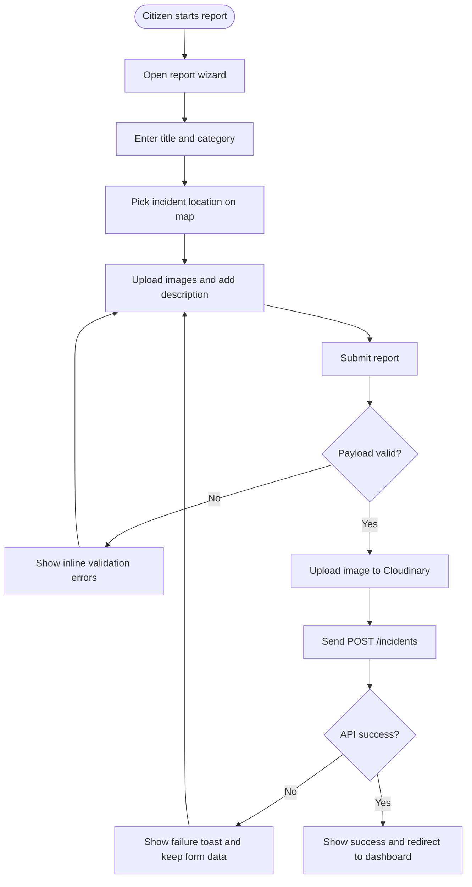
```mermaid
flowchart TD
    A([Citizen starts report]) --> B[Open report wizard]
    B --> C[Enter title and category]
    C --> D[Pick incident location on map]
    D --> E[Upload images and add description]
    E --> F[Submit report]
    F --> G{Payload valid?}
    G -->|No| H[Show inline validation errors]
    H --> E
    G -->|Yes| I[Upload image to Cloudinary]
    I --> J[Send POST /incidents]
    J --> K{API success?}
    K -->|No| L[Show failure toast and keep form data]
    L --> E
    K -->|Yes| M[Show success and redirect to dashboard]
```
    

### **Use Case:** UC-02 Review, Prioritize, and Update Incident Lifecycle

**ID:** UC-02 **Primary Actor:** City Admin (Manager)

**Goal:** Review a newly reported incident, assign a priority, and update its status to reflect current maintenance actions.

**Preconditions:** Admin is logged in and is viewing the Backoffice Dashboard.

**Postconditions:** The incident priority/status are updated globally and the reporting citizen sees the latest public-safe state.

**Trigger:** Admin navigates to the "Incidents List" view.

**Main Flow**

1. Admin applies filters to show only "New" status incidents.
    
2. System updates the data table to display the filtered results.
    
3. Admin clicks on a specific incident row to open the Detail View.
    
4. Admin reviews the description, photo, and map location.
    
5. Admin assigns a priority level (for example, "High").
    
6. Admin either updates the status directly or clicks "Plan actions for this incident" from the detail workspace.
    
7. If the planning flow is used, the system opens the planned action form already linked to the current incident.
    
8. Admin optionally adds an internal note or public comment and saves the changes.
    
9. System updates the record via API; if a planned action was created successfully, the incident status is also updated automatically to `PLANNED`.
    
10. System displays a success toast and updates the UI to reflect the new priority, status, and linked actions.

**Alternate Flows**

- **A1 (Plan Action from Detail):** In Step 6, the admin starts the planned action form from the incident detail CTA. After successful creation, the new action is linked to the incident and the incident status changes automatically to `PLANNED`.
    

**Error Flows**

- **E1 (Permissions Error):** If the Admin attempts to update an incident but their session has expired or they lack specific area permissions, the system blocks the action and shows a 403/401 error toast, redirecting to login if necessary.

**Flow Diagram**

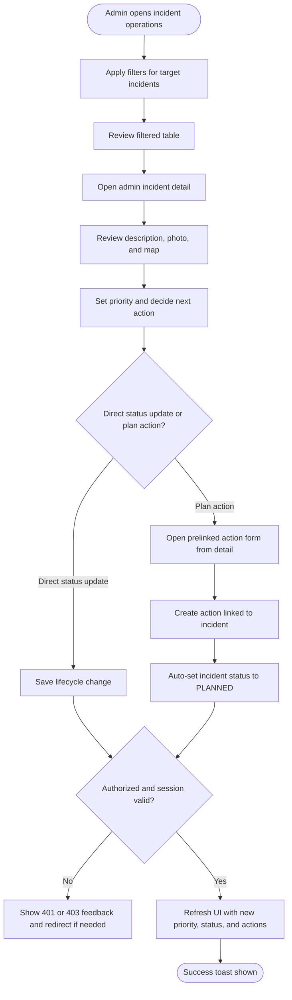
```mermaid
flowchart TD
    A([Admin opens incident operations]) --> B[Apply filters for target incidents]
    B --> C[Review filtered table]
    C --> D[Open admin incident detail]
    D --> E[Review description, photo, and map]
    E --> F[Set priority and decide next action]
    F --> G{Direct status update or plan action?}
    G -->|Direct status update| H[Save lifecycle change]
    G -->|Plan action| I[Open prelinked action form from detail]
    I --> J[Create action linked to incident]
    J --> K[Auto-set incident status to PLANNED]
    H --> L{Authorized and session valid?}
    K --> L
    L -->|No| M[Show 401 or 403 feedback and redirect if needed]
    L -->|Yes| N[Refresh UI with new priority, status, and actions]
    N --> O([Success toast shown])
```

### **Use Case:** UC-03 User Authentication & Routing

**ID:** UC-03 **Primary Actor:** Citizen / City Admin

**Goal:** Authenticate securely to access role-specific platform features.

**Preconditions:** User is unauthenticated and navigates to the app.

**Postconditions:** A valid JWT session is established and the user is routed to their corresponding home view.

**Trigger:** User clicks "Login" and starts Google Sign-In.

**Main Flow**

1. User clicks "Sign in with Google", triggering the Firebase OAuth popup.
    
2. User completes Google authentication.
    
3. System validates the Google authentication result via Firebase Auth.
    
4. System retrieves the auth token and fetches the user's role profile from the backend API.
    
5. System stores the session state locally (Signals/Store).
    
6. System evaluates the user role:
    
    - If Citizen: Redirects to `/dashboard/my-incidents` (Citizen Dashboard).
        
    - If Admin: Redirects to `/admin/incidents` (Backoffice).
        

**Error Flows**

- **E1 (OAuth Error):** In Step 2/3, if Firebase returns an auth error or popup cancellation, the system displays "Error signing in with Google. Please try again.".

**Flow Diagram**

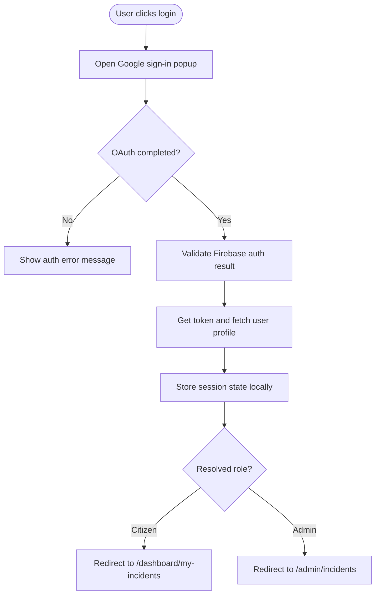
```mermaid
flowchart TD
    A([User clicks login]) --> B[Open Google sign-in popup]
    B --> C{OAuth completed?}
    C -->|No| D[Show auth error message]
    C -->|Yes| E[Validate Firebase auth result]
    E --> F[Get token and fetch user profile]
    F --> G[Store session state locally]
    G --> H{Resolved role?}
    H -->|Citizen| I[Redirect to /dashboard/my-incidents]
    H -->|Admin| J[Redirect to /admin/incidents]
```

### **Use Case:** UC-04 Explore and Filter Public Incidents

**ID:** UC-04 **Primary Actor:** Unauthenticated Visitor / Citizen / City Admin

**Goal:** Discover incidents through a synchronized list-and-map experience and narrow results using search and filters.

**Preconditions:** The incidents listing endpoint is available and returns public-safe data; a city context is selected or resolved by default.

**Postconditions:** The user sees a filtered incident result set and can navigate to a specific incident detail page while preserving query context.

**Trigger:** User navigates to the Incidents Explorer route (`/incidents`).

**Main Flow**

1. System loads the default incidents page and synchronized map markers.
    
2. User selects or switches city context and enters a keyword and/or applies one or more filters such as status, category, date, city, or area.
    
3. System updates the query state and requests the filtered dataset from the API.
    
4. System refreshes the list and map markers in sync.
    
5. User optionally changes sort order, pagination, or map viewport.
    
6. System preserves the active filters and visible result count.
    
7. User selects one incident from the list or map to open its detail page.

**Alternate Flows**

- **A1 (Empty Results):** If the filters produce no matches, the system shows an empty state with a clear option to reset filters.

**Error Flows**

- **E1 (Partial UI Failure):** If list data loads but map markers fail, the system keeps the list available and shows a localized map error state with retry.

**Flow Diagram**

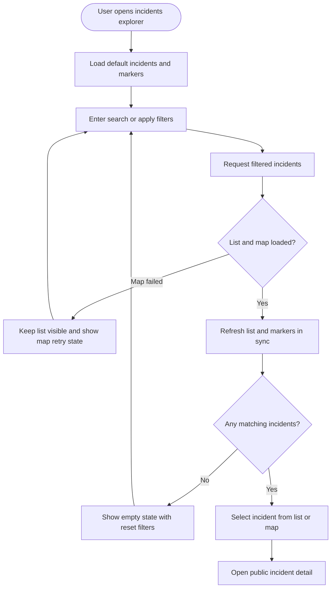
```mermaid
flowchart TD
    A([User opens incidents explorer]) --> B[Load default incidents and markers]
    B --> C[Enter search or apply filters]
    C --> D[Request filtered incidents]
    D --> E{List and map loaded?}
    E -->|Map failed| F[Keep list visible and show map retry state]
    F --> C
    E -->|Yes| G[Refresh list and markers in sync]
    G --> H{Any matching incidents?}
    H -->|No| I[Show empty state with reset filters]
    I --> C
    H -->|Yes| J[Select incident from list or map]
    J --> K[Open public incident detail]
```

### **Use Case:** UC-05 View Public Incident Transparency Detail

**ID:** UC-05 **Primary Actor:** Unauthenticated Visitor / Citizen / City Admin

**Goal:** Review a single incident's public-safe metadata, lifecycle status, evidence, and related planned actions.

**Preconditions:** A valid public incident exists and is accessible through the public detail endpoint.

**Postconditions:** The user understands the incident context and current lifecycle state and can continue to related public views.

**Trigger:** User opens an incident detail from the explorer, dashboard, or direct URL (`/incidents/:id`).

**Main Flow**

1. System fetches the incident detail by id.
    
2. System displays title, category, status, description, location, timestamps, and evidence images.
    
3. System renders the location map and any related public-safe planned actions.
    
4. User reviews the current state and, if needed, follows links back to the explorer or to planned actions.

**Error Flows**

- **E1 (Not Found / Not Public):** If the incident does not exist or is not publicly accessible, the system shows a not-found or unauthorized-safe fallback view.

**Flow Diagram**

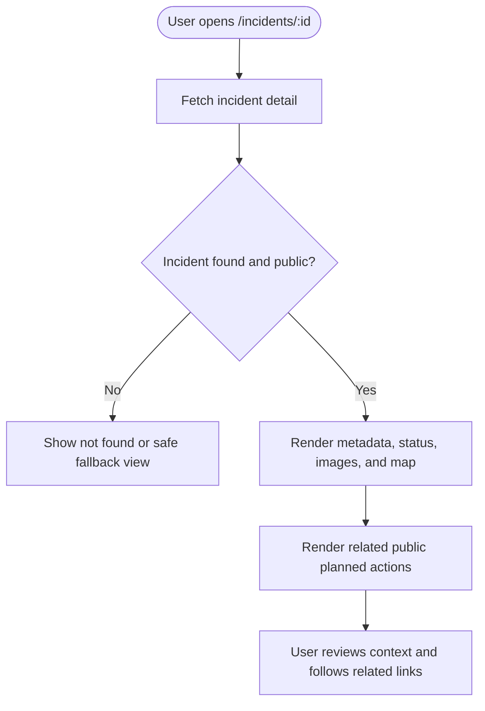
```mermaid
flowchart TD
    A([User opens /incidents/:id]) --> B[Fetch incident detail]
    B --> C{Incident found and public?}
    C -->|No| D[Show not found or safe fallback view]
    C -->|Yes| E[Render metadata, status, images, and map]
    E --> F[Render related public planned actions]
    F --> G[User reviews context and follows related links]
```

### **Use Case:** UC-06 Track My Reported Incidents

**ID:** UC-06 **Primary Actor:** Citizen

**Goal:** Review all incidents previously reported by the logged-in citizen and monitor their current status.

**Preconditions:** Citizen is authenticated and has access to the private dashboard.

**Postconditions:** The citizen can see their incident portfolio, understand status changes, and navigate to report or detail flows.

**Trigger:** Citizen opens `/dashboard/my-incidents` or is redirected there after login/report submission.

**Main Flow**

1. System resolves the authenticated user and requests incidents filtered by `reporterId`.
    
2. System displays the citizen's incidents as cards or rows with key information such as title, category, date, and status.
    
3. Citizen optionally sorts or filters the list.
    
4. Citizen opens one incident to inspect its detail.
    
5. If the list is empty, the system displays an empty state with a prominent "Report an Issue" CTA.

**Error Flows**

- **E1 (Session Expired):** If the user session is no longer valid, the system redirects to login and preserves the intended destination when possible.

**Flow Diagram**

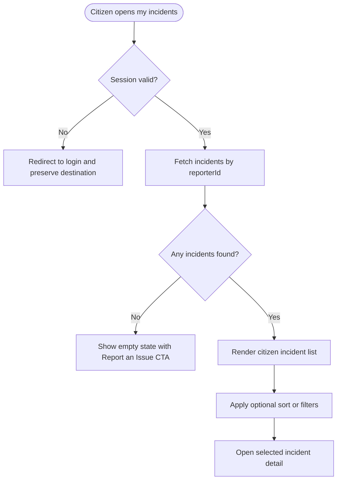
```mermaid
flowchart TD
    A([Citizen opens my incidents]) --> B{Session valid?}
    B -->|No| C[Redirect to login and preserve destination]
    B -->|Yes| D[Fetch incidents by reporterId]
    D --> E{Any incidents found?}
    E -->|No| F[Show empty state with Report an Issue CTA]
    E -->|Yes| G[Render citizen incident list]
    G --> H[Apply optional sort or filters]
    H --> I[Open selected incident detail]
```

### **Use Case:** UC-07 Edit or Delete Own Incident Under Policy

**ID:** UC-07 **Primary Actor:** Citizen

**Goal:** Correct or remove a previously submitted incident while it is still in an editable lifecycle state.

**Preconditions:** Citizen is authenticated, is the incident owner, and the incident status still allows edit/delete operations.

**Postconditions:** The incident is updated or deleted, and citizen/admin/public lists are refreshed according to invalidation rules.

**Trigger:** Citizen selects Edit or Delete from their dashboard or from an incident they own.

**Main Flow**

1. System verifies that the current user owns the incident and that its status is `NEW` or `UNDER_REVIEW`.
    
2. System opens the editable form prefilled with the current incident values.
    
3. Citizen updates allowed fields such as title, description, category, location, or images, or confirms deletion.
    
4. System validates the request against client and backend rules.
    
5. System sends the corresponding `PATCH` or `DELETE` request.
    
6. System confirms success and refreshes the affected dashboard/detail views.

**Error Flows**

- **E1 (Policy Violation):** If the incident lifecycle changed before submission, the system blocks the operation and explains that the incident can no longer be edited or deleted.

**Flow Diagram**

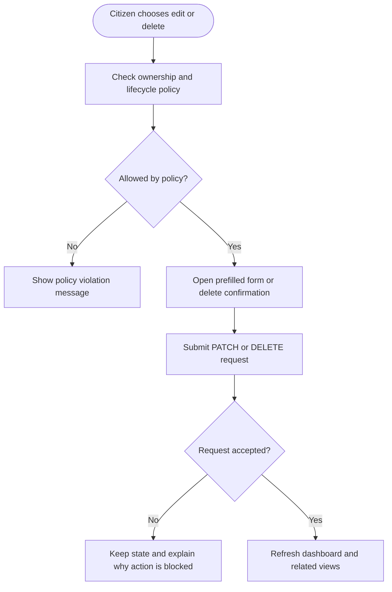
```mermaid
flowchart TD
    A([Citizen chooses edit or delete]) --> B[Check ownership and lifecycle policy]
    B --> C{Allowed by policy?}
    C -->|No| D[Show policy violation message]
    C -->|Yes| E[Open prefilled form or delete confirmation]
    E --> F[Submit PATCH or DELETE request]
    F --> G{Request accepted?}
    G -->|No| H[Keep state and explain why action is blocked]
    G -->|Yes| I[Refresh dashboard and related views]
```

### **Use Case:** UC-08 Browse Planned Actions Calendar

**ID:** UC-08 **Primary Actor:** Unauthenticated Visitor / Citizen / City Admin

**Goal:** Review scheduled maintenance actions in calendar or agenda format and understand which incidents they are linked to.

**Preconditions:** The planned actions endpoint is available and exposes public-safe calendar data; a city context is selected or resolved by default.

**Postconditions:** The user sees the scheduled actions for the selected time period and can navigate to linked incident details.

**Trigger:** User navigates to `/planned-actions`.

**Main Flow**

1. System loads planned actions for the current city context and calendar range.
    
2. System displays the events in calendar or agenda format.
    
3. User changes date range or switches the calendar presentation mode.
    
4. System refreshes the visible events for the selected range.
    
5. User opens an action to inspect its summary and linked incident.

**Alternate Flows**

- **A1 (No Events):** If no planned actions exist for the selected range, the system displays an empty calendar state with helpful guidance.

**Error Flows**

- **E1 (Read Failure):** If the calendar data request fails, the system shows an inline error state with retry while preserving the selected range.

**Flow Diagram**

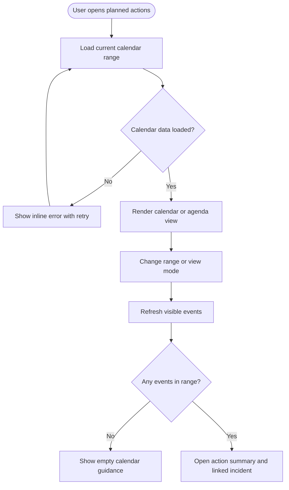
```mermaid
flowchart TD
    A([User opens planned actions]) --> B[Load current calendar range]
    B --> C{Calendar data loaded?}
    C -->|No| D[Show inline error with retry]
    D --> B
    C -->|Yes| E[Render calendar or agenda view]
    E --> F[Change range or view mode]
    F --> G[Refresh visible events]
    G --> H{Any events in range?}
    H -->|No| I[Show empty calendar guidance]
    H -->|Yes| J[Open action summary and linked incident]
```

### **Use Case:** UC-09 Manage Planned Actions for an Incident

**ID:** UC-09 **Primary Actor:** City Admin

**Goal:** Create, update, or delete a planned action linked to a specific incident.

**Preconditions:** Admin is authenticated, authorized, and working within a valid city scope; the related incident exists.

**Postconditions:** On creation, the action is persisted, linked to the incident, immediately reflected in the admin calendar and incident detail views, and the incident status becomes `PLANNED`. On update/delete, the related calendar and incident detail views reflect the latest action state, and if all linked planned actions are deleted or become `CANCELLED` the incident status recalculates to `CANCELLED`.

**Trigger:** Admin clicks "Plan actions for this incident" in the Admin Incident Detail view or starts the action flow from `/admin/planned-actions`.

**Main Flow**

1. Admin opens an incident detail and clicks "Plan actions for this incident", or starts the same flow from `/admin/planned-actions`.
    
2. System presents the planned action form; when launched from incident detail, the target `incidentId` is prefilled and locked.
    
3. Admin completes or updates the action data.
    
4. System validates required fields and date consistency.
    
5. Admin submits the form.
    
6. System persists the action via API and links it to the selected incident.
    
7. System updates the linked incident status automatically to `PLANNED`.
    
8. System refreshes the calendar and linked incident detail and displays a success message.

**Alternate Flows**

- **A1 (Create from Calendar Route):** Admin starts the planned action form from `/admin/planned-actions`, selects the incident manually, and submits the action.

- **A2 (Delete Action):** Admin deletes an existing planned action after confirmation, and the system removes it from the calendar and incident detail. If all linked planned actions are deleted or become `CANCELLED`, the incident status recalculates to `CANCELLED`.

**Error Flows**

- **E1 (Validation or Permission Error):** If the schedule is invalid or the user lacks permission, the system blocks the mutation and shows actionable feedback without losing the entered data.

**Flow Diagram**

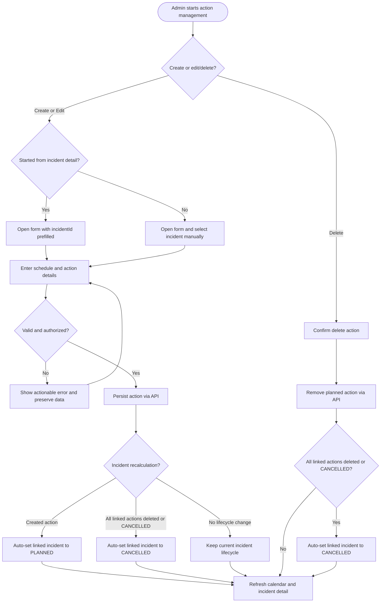
```mermaid
flowchart TD
    A([Admin starts action management]) --> B{Create or edit/delete?}
    B -->|Create or Edit| C{Started from incident detail?}
    C -->|Yes| D[Open form with incidentId prefilled]
    C -->|No| E[Open form and select incident manually]
    D --> F[Enter schedule and action details]
    E --> F
    F --> G{Valid and authorized?}
    G -->|No| H[Show actionable error and preserve data]
    H --> F
    G -->|Yes| I[Persist action via API]
    I --> J{Incident recalculation?}
    J -->|Created action| K[Auto-set linked incident to PLANNED]
    J -->|All linked actions deleted or CANCELLED| L[Auto-set linked incident to CANCELLED]
    J -->|No lifecycle change| M[Keep current incident lifecycle]
    K --> N[Refresh calendar and incident detail]
    L --> N
    M --> N
    B -->|Delete| O[Confirm delete action]
    O --> P[Remove planned action via API]
    P --> Q{All linked actions deleted or CANCELLED?}
    Q -->|Yes| R[Auto-set linked incident to CANCELLED]
    Q -->|No| N
    R --> N
```

### **Use Case:** UC-10 Review Public Statistics Dashboard

**ID:** UC-10 **Primary Actor:** Unauthenticated Visitor / Citizen / City Admin

**Goal:** Inspect aggregate incident metrics and trends to understand the state of incidents across time, category, status, and location.

**Preconditions:** Statistics endpoints are available and the dashboard can access the required aggregated datasets for the selected city context.

**Postconditions:** The user sees updated KPI and chart data for the selected filter context.

**Trigger:** User navigates to `/statistics`.

**Main Flow**

1. System loads the default dashboard timeframe and filter state.
    
2. System requests KPI summaries and chart datasets.
    
3. System renders the main metrics and visualizations.
    
4. User adjusts one or more filters such as timeframe, category, status, or location.
    
5. System refreshes the affected widgets with the new aggregate results.

**Alternate Flows**

- **A1 (No Data):** If no statistics are available for the selected filters, the system shows a no-data state instead of empty charts.

**Error Flows**

- **E1 (Widget Error):** If one metric or chart fails to load, the system keeps the remaining widgets visible and marks the failed one with retry feedback.

**Flow Diagram**

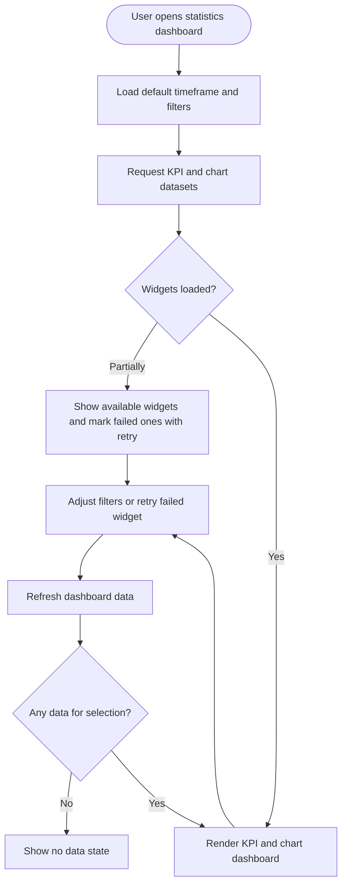
```mermaid
flowchart TD
    A([User opens statistics dashboard]) --> B[Load default timeframe and filters]
    B --> C[Request KPI and chart datasets]
    C --> D{Widgets loaded?}
    D -->|Partially| E[Show available widgets and mark failed ones with retry]
    D -->|Yes| F[Render KPI and chart dashboard]
    E --> G[Adjust filters or retry failed widget]
    F --> G
    G --> H[Refresh dashboard data]
    H --> I{Any data for selection?}
    I -->|No| J[Show no data state]
    I -->|Yes| F
```

## 6. User Stories

### **Story:** US-01: Citizen Google Sign-In

As a **Citizen** I want **to securely sign in with my Google account** So that **I can access my dashboard and start reporting incidents in my city.**

**Acceptance Criteria**

- User can click "Sign in with Google" and complete Firebase OAuth authentication.
    
- OAuth failures/cancellations display a clear error message.
    
- Upon successful login, the user is redirected to the Citizen Dashboard.
    

**Technical Notes**

- Integrate Firebase Auth SDK (Google provider). Store user session state via a Signal in an `AuthService`.

### **Story:** US-02: Report New Incident

As a **Citizen** I want **to submit a new incident providing a category, description, and an image** So that **the municipality has enough context to understand and fix the issue.**

**Acceptance Criteria**

- The form must require: Title, Category (dropdown), Description (text area), incident location (map coordinates), and at least one image upload.
    
- "Submit" button is disabled until the form is valid.
    
- Upon successful submission, a toast message is shown and the user is redirected to the dashboard.
    

**Technical Notes**

- Integrate Cloudinary upload widget or direct API for the image. The backend should handle the POST to `/incidents`.

### **Story:** US-03: Geolocation Map Picker

As a **Citizen** I want **to drop a pin on an interactive map when reporting an incident** So that **the city workers know the exact location of the problem without needing a typed address.**

**Acceptance Criteria**

- A map component is visible within the incident creation flow.
    
- User can click/tap to place or move a marker.
    
- A "Use my current location" button centers the map based on browser GPS.
    
- Selected coordinates (lat, lng) are saved and appended to the incident form payload.
    

**Technical Notes**

- Integrate Leaflet using an Angular-21-compatible approach (wrapper verified for Angular 21 or direct Leaflet integration), or use Google Maps API. Use browser `navigator.geolocation` API.

### **Story:** US-04: Citizen Dashboard (My Incidents)

As a **Citizen** I want **to see a list of all the incidents I have reported** So that **I can track whether they are pending, in progress, or resolved.**

**Acceptance Criteria**

- Page displays a list/grid of incident cards.
    
- Each card shows: Thumbnail image, Title/Category, Date reported, and a Status badge (color-coded).
    
- Empty state is displayed if the user has 0 reported incidents, providing a clear CTA to "Report an Issue".
    

**Technical Notes**

- Requires a GET request to `/incidents?reporterId={current_user_id}`. Use `computed` signals to calculate derived states (e.g., empty lists).

### **Story:** US-05: Admin Incident Backoffice

As a **City Admin** I want **to view a paginated data table of all reported incidents** So that **I can review them and decide what needs maintenance first.**

**Acceptance Criteria**

- Table displays columns: ID, Category, Priority, Date, Status, Reporter, and Action.
    
- Table supports pagination (e.g., 10, 25, 50 items per page).
    
- Only users with the 'Admin' role can access this route; others are redirected to an unauthorized page.
    

**Technical Notes**

- Implement Route Guards (`AuthGuard`, `RoleGuard`). Backend must support pagination parameters (`?page=0&size=10`) and return reporter presentation data (`reporterDisplayName`) for table rendering.

### **Story:** US-06: Backoffice Filters & Search

As a **City Admin** I want **to filter incidents by Status and Category, and search by keyword** So that **I can quickly find specific issues or see how many "Potholes" are currently "New".**

**Acceptance Criteria**

- Filter panel exists above the table with dropdowns for Status and Category, and a text input for keyword search.
    
- Applying filters updates the table data asynchronously.
    
- Multiple filters can be applied simultaneously (e.g., Category: Lighting AND Status: New).
    
- A "Clear Filters" button resets the view.
    

**Technical Notes**

- Use RxJS `combineLatest` or `debounceTime` (for text input) connected to Angular Signals to trigger API calls efficiently without spamming the backend.

### **Story:** US-07: Update Incident Status

As a **City Admin** I want **to change the lifecycle status of an incident (e.g., New -> In Progress)** So that **the citizen is informed and internal metrics reflect the work being done.**

**Acceptance Criteria**

- In the Incident Detail View, the admin sees a "Status" dropdown.
    
- Changing the dropdown and clicking "Save" updates the status.
    
- A success notification (toast) confirms the update.
    
- The updated status is immediately reflected in the admin table and the citizen's dashboard.
    

**Technical Notes**

- Triggers a PATCH request to `/incidents/{id}/status`. Handle potential 400/500 HTTP errors gracefully using the global Error Interceptor.

### **Story:** US-08: Plan Action from Incident Detail

As a **City Admin** I want **to create a planned action directly from an incident detail page** So that **I can schedule the response in context and automatically move the incident into the planned stage.**

**Acceptance Criteria**

- The Admin Incident Detail page exposes a prominent "Plan actions for this incident" CTA.
    
- Clicking the CTA opens the planned action form with the current `incidentId` prefilled and non-editable.
    
- On successful creation, the planned action is linked to the incident and appears in both the incident detail and the planned actions calendar.
    
- After successful creation, the incident status changes automatically to `PLANNED` and the updated status is visible immediately.

**Technical Notes**

- Reuse the same planned action form used by `/admin/planned-actions`, but support a preselected incident context from `/admin/incidents/:id`. Treat the incident status update to `PLANNED` as a backend-managed side effect of successful planned action creation, and recalculate the incident to `CANCELLED` when all linked planned actions are deleted or become `CANCELLED`.

## 7. Information Architecture

### 7.1 Pages / Views

|**Page**|**Purpose**|**Access Type**|
|---|---|---|
|**Home / Landing**|Introduce the platform and provide a call to action to report issues.|Public|
|**Login (Google Sign-In)**|Authentication flow via Firebase Google Sign-In.|Public (Unauthenticated)|
|**Incidents Explorer**|Split view showing a filterable list of incidents on the left and a synchronized interactive map with results on the right.|Public|
|**Incident Detail**|View specific incident metadata, images, and current status.|Public|
|**Statistics**|Public analytics page with incident trends and aggregates.|Public|
|**Planned Actions**|Calendar view showing scheduled maintenance and corrective actions to resolve reported incidents. UI capabilities expand by access state, support city-scoped public viewing, and keep admin creation here as a secondary entry point.|Public (read) / Private (Admin manage)|
|**Citizen Dashboard**|List of incidents reported by the logged-in citizen.|Private (Citizen)|
|**Report Incident (Wizard)**|Step-by-step form to categorize, geolocate, and submit a new issue.|Private (Citizen)|
|**Admin Incidents List**|Global data table to filter, search, and manage all incidents.|Private (Admin)|
|**Admin Incident Detail**|Manage lifecycle, update status, add internal notes, and use the primary CTA to plan actions for the current incident.|Private (Admin)|
|**Not Found (404)**|Fallback route for unknown URLs.|Public|

### 7.2 Navigation

- **Main navigation:** Contextual based on the active role:
    
    - _Public/Unauthenticated:_ Home, Incidents Explorer, Planned Actions, Statistics, Login.
        
    - _Citizen:_ Dashboard, Report Issue, Incidents Explorer, Planned Actions, Statistics.
        
    - _Admin:_ Statistics, Manage Incidents, Planned Actions.
        
- **Secondary navigation:** Session menu with Logout for authenticated users.
    
- **Footer navigation:** Terms of Service, Privacy Policy, Help/FAQ, Contact.
    
- **Breadcrumbs:** Essential for nested Admin flows (e.g., `Admin > Manage Incidents > Incident #123`) and the Citizen Report flow to maintain context.
    
- **Search / filters:** _Incidents Explorer:_ Sidebar filters interacting directly with both the list items and the map markers simultaneously.
    
    - _Admin List:_ Complex filter bar (Status + Category + Date dropdowns) and a keyword search input field.

### 7.3 Route Map

```
/
├── /login
├── /incidents             <-- (Split view: filterable list + map)
│   └── /:id               <-- (Public incident detail)
├── /planned-actions       <-- (City-scoped calendar showing scheduled resolutions with role-based enhancements)
├── /statistics            <-- (Public analytics)
├── /dashboard             <-- (Citizen area)
│   ├── /my-incidents
│   ├── /report            <-- (Creation wizard)
├── /admin                 <-- (Admin area)
│   ├── /incidents         <-- (Management table)
│   │   └── /:id           <-- (Lifecycle management + primary action planning)
│   └── /planned-actions   <-- (Admin calendar management + secondary action entry)
└── /not-found
```

**Architecture decision (7.3):** Keep two routes for Planned Actions: `/planned-actions` (public access with limited capabilities) and `/admin/planned-actions` (admin access with management capabilities). The primary admin creation entry point lives in `/admin/incidents/:id` through the contextual "Plan actions for this incident" CTA, while `/admin/planned-actions` remains a secondary overview and management route. Public explorer, planned actions, and statistics remain multi-city through shared city-aware filters/context. Both admin entry points can reuse the same base planned-action form with role-based permissions and UI adaptations.

## 8. Screen / Page Analysis

The following analysis defines each primary route from the perspective of purpose, user actions, UI structure, state behavior, responsiveness, and accessibility.

### 8.1 Home / Landing (`/`)

- **Purpose:** Explain product value and drive users to report issues or explore incidents.
- **Main user actions:** Navigate to Login, open Incidents Explorer, switch city context, or start the Report Issue flow (authenticated users continue directly; unauthenticated users are redirected to login).
- **UI sections:** Hero with CTA, trust/value section, quick stats teaser, footer links.
- **States:** Initial (unauthenticated), loading skeleton for dynamic counters, CTA success navigation, API error fallback for counters.
- **Responsive notes:** Mobile single-column with sticky CTA; tablet two-block hero; desktop wider hero plus supporting stats/cards.
- **Accessibility notes:** One clear H1, descriptive CTA labels, visible focus rings, landmark regions (`header/main/footer`), contrast-safe hero text.

### 8.2 Login (`/login`)

- **Purpose:** Authenticate users with Google OAuth and route by role.
- **Main user actions:** Trigger Google sign-in and complete OAuth popup flow.
- **UI sections:** Auth header, primary Google sign-in CTA, inline feedback area, support links.
- **States:** Initial, submitting (button loading), success redirect, auth error with inline message.
- **Responsive notes:** Mobile full-width form with large touch targets; tablet centered card; desktop split layout with contextual branding panel.
- **Accessibility notes:** Keyboard-operable sign-in CTA, `aria-describedby` for error feedback, logical focus order, and clear popup-failure messaging.

### 8.3 Incidents Explorer (`/incidents`)

- **Purpose:** Offer public discovery with synchronized list + map to inspect incidents quickly.
- **Main user actions:** Switch city context, search, apply combined filters, pan/zoom map, open incident detail.
- **UI sections:** Top city/filter/search bar, incident results pane, interactive map pane, pagination controls.
- **States:** Initial with default city/filter context, loading results/map markers, empty-result state, partial error state (list/map degraded independently).
- **Responsive notes:** Mobile stacked (filters -> list -> map); tablet resizable split; desktop persistent two-column split view.
- **Accessibility notes:** Keyboard-friendly filters, table/list semantics, marker alternatives via list links, polite live-region updates on result count changes.

### 8.4 Public Incident Detail (`/incidents/:id`)

- **Purpose:** Show full metadata and lifecycle visibility for transparency.
- **Main user actions:** Review status timeline, inspect image/map location, navigate to related views.
- **UI sections:** Metadata header, status badge/timeline, evidence media section, location map, related actions block.
- **States:** Initial, loading, not-found (404), success, API error with retry CTA.
- **Responsive notes:** Mobile vertical card sections; tablet two-column metadata/media; desktop three-zone content (details, map, actions).
- **Accessibility notes:** Semantic headings hierarchy, status announced to screen readers, image alt text policy, keyboard operable media/map fallbacks.

### 8.5 Planned Actions (`/planned-actions`, `/admin/planned-actions`)

- **Purpose:** Visualize scheduled maintenance and connect actions to incidents.
- **Main user actions:** Switch city context, browse calendar slots, open action details, and for admins use this route as a secondary place to create/edit/delete actions.
- **UI sections:** City/date controls, calendar grid/list toggle, event detail panel, admin action toolbar for secondary action entry.
- **States:** Initial current month/week, loading events, empty calendar state, permission-gated admin controls, mutation success/error feedback.
- **Responsive notes:** Mobile agenda/list default; tablet compact calendar; desktop full calendar with side detail panel.
- **Accessibility notes:** Keyboard calendar navigation, clear selected-day state, color-independent status indicators, announcements for event create/update/delete.

### 8.6 Citizen Dashboard (`/dashboard/my-incidents`)

- **Purpose:** Let citizens track their reports and quickly create new ones.
- **Main user actions:** Review own incidents, filter/sort list, open incident detail, start report wizard.
- **UI sections:** Dashboard header with CTA, incident cards/grid, quick filters, empty-state panel.
- **States:** Initial, loading skeleton cards, empty with Report CTA, success list, API error with retry.
- **Responsive notes:** Mobile single-column cards; tablet two-column cards; desktop three-column grid with compact filters.
- **Accessibility notes:** Card actions exposed as links/buttons with clear names, status badges include text labels, focus order follows visual order.

### 8.7 Report Incident Wizard (`/dashboard/report`)

- **Purpose:** Collect valid incident data in guided steps to reduce user friction.
- **Main user actions:** Enter title, select category, add description/photo, pick map location, submit report.
- **UI sections:** Stepper header, step content panel, map picker, image upload area, sticky action footer (Back/Next/Submit).
- **States:** Initial step, per-step validation errors, image upload progress, submission loading, success redirect, API error preserving form data.
- **Responsive notes:** Mobile step-by-step full width with sticky actions; tablet balanced form/map sections; desktop split form + live preview.
- **Accessibility notes:** Stepper supports keyboard navigation, errors announced and linked to fields, upload constraints communicated in text, submit disabled state explained.

### 8.8 Statistics (`/statistics`)

- **Purpose:** Provide a public transparency dashboard for incident trends with the same capabilities for all users.
- **Main user actions:** Switch city context, browse KPIs/charts, adjust timeframe filters, and drill into categories.
- **UI sections:** City-aware KPI strip, charts area, geospatial/category breakdowns, and filter bar.
- **States:** Initial default city/timeframe, loading chart placeholders, no-data state, and partial widget errors.
- **Responsive notes:** Mobile vertical KPI and chart cards; tablet 2-column analytics cards; desktop dashboard grid with persistent filter bar.
- **Accessibility notes:** Data tables for chart alternatives, ARIA labels on chart controls, contrast-safe palettes, keyboard reachable drill-down links.

### 8.9 Admin Incidents List (`/admin/incidents`)

- **Purpose:** Central operations table for triage, filtering, and lifecycle management.
- **Main user actions:** Apply combined filters, search keyword, paginate, open incident detail, bulk triage (future).
- **UI sections:** Advanced filter bar, results table, pagination/footer controls, optional side summary.
- **States:** Initial with persisted filters, loading rows, empty result state, permission error (403), API failure with retry.
- **Responsive notes:** Mobile card-list alternative with condensed fields; tablet compact table with horizontal scroll guard; desktop full data table.
- **Accessibility notes:** Sortable headers with `aria-sort`, row action buttons with explicit names, keyboard pagination controls, filter form grouping with fieldsets.

### 8.10 Admin Incident Detail (`/admin/incidents/:id`)

- **Purpose:** Enable priority/lifecycle updates, internal notes, and the primary in-context flow to plan actions for one incident.
- **Main user actions:** Change priority, change status, add notes/comments, click "Plan actions for this incident", and review linked actions.
- **UI sections:** Incident summary header, editable priority/lifecycle panel, notes/history thread, planned-actions panel with primary CTA, map/media context block.
- **States:** Initial, loading, edit mode, planned-action create success with auto status refresh to `PLANNED`, planned-action delete/cancel success with auto status refresh to `CANCELLED` when all linked planned actions are deleted or become `CANCELLED`, validation/API error, unauthorized redirect on expired session.
- **Responsive notes:** Mobile stacked editable blocks; tablet dual-column edit/context; desktop focus column + supporting context sidebar.
- **Accessibility notes:** Form controls grouped with legends, save feedback announced via live region, clear focus return after save, semantic timeline for history.

### 8.11 Not Found (`/not-found`)

- **Purpose:** Handle unknown routes and recover users to meaningful paths.
- **Main user actions:** Return home, go back, navigate to role-relevant dashboard if authenticated.
- **UI sections:** Error illustration/text, primary recovery CTA, secondary navigation links.
- **States:** Static success state (no loading), optional generic fallback copy if content resources fail.
- **Responsive notes:** Mobile centered single column; tablet/desktop same composition with larger illustration and spacing.
- **Accessibility notes:** Clear page title (`404 - Page not found`), focus lands on main heading, CTAs keyboard reachable, no motion-heavy distractions.

## 9. Domain Model

### 9.1 Core Entities

|Entity|Description|Key Fields|
|---|---|---|
|**User**|Authenticated platform user (Citizen or Admin).|`id`, `firebaseUid`, `email`, `displayName`, `role`, `cityId`, `createdAt`|
|**City**|Tenant boundary for data segregation and permissions.|`id`, `name`, `slug`, `timezone`, `isActive`|
|**Incident**|Main business object reported by a citizen and managed by admins.|`id`, `title`, `description`, `category`, `status`, `priority`, `reporterId`, `cityId`, `location`, `images`, `createdAt`, `updatedAt`|
|**IncidentLocation**|Geospatial data attached to one incident.|`lat`, `lng`, `addressLabel`, `area`, `geohash`|
|**IncidentImage**|Evidence media metadata (stored in Cloudinary).|`id`, `incidentId`, `url`, `thumbnailUrl`, `publicId`, `mimeType`, `sizeKb`, `uploadedAt`|
|**PlannedAction**|Scheduled maintenance action linked to an incident.|`id`, `incidentId`, `title`, `description`, `scheduledStart`, `scheduledEnd`, `status`, `assignedToUserId`, `createdBy`|
|**IncidentComment**|Public/admin notes attached to incident history.|`id`, `incidentId`, `authorId`, `visibility`, `message`, `createdAt`|
|**IncidentStatusHistory**|Audit trail of lifecycle changes over time.|`id`, `incidentId`, `fromStatus`, `toStatus`, `changedBy`, `reason`, `changedAt`|
|**IncidentFilter**|Query object used by explorer/admin list and map sync.|`search`, `statuses`, `categories`, `cityId`, `area`, `dateFrom`, `dateTo`, `sortBy`, `sortDir`, `page`, `size`|

### 9.2 Value Objects and Enums

- **Role:** `CITIZEN`, `ADMIN`.
- **IncidentCategory:** `POTHOLE`, `LIGHTING`, `STREET_FURNITURE`, `CLEANLINESS`, `NOISE`, `GRAFFITI`, `OTHER`.
- **IncidentStatus:** `NEW`, `UNDER_REVIEW`, `PLANNED`, `IN_PROGRESS`, `RESOLVED`, `REJECTED`, `CANCELLED`.
- **IncidentPriority:** `LOW`, `MEDIUM`, `HIGH`, `CRITICAL`.
- **ActionStatus:** `PLANNED`, `CONFIRMED`, `DONE`, `CANCELLED`.
- **CommentVisibility:** `PUBLIC`, `INTERNAL`.

### 9.3 Relationships

- One **City** has many **Users** and many **Incidents**.
- One **User** (Citizen) reports many **Incidents**; each **Incident** has one reporter.
- One **Incident** has one **IncidentLocation** (composition).
- One **Incident** has many **IncidentImage** entries.
- One **Incident** has many **PlannedAction** entries.
- One **Incident** has many **IncidentComment** entries.
- One **Incident** has many **IncidentStatusHistory** entries.
- One **User** can create many **IncidentComment** records; Admin users additionally create many **PlannedAction** and **IncidentStatusHistory** records.
- One **IncidentFilter** affects list queries and marker queries simultaneously to keep map/list synchronized.

### 9.4 Domain Rules (MVP)

- **Ownership:** Citizen can edit/delete only incidents they created and only while status is `NEW` or `UNDER_REVIEW`.
- **Lifecycle control:** Only Admin can trigger incident status transitions, either directly via the status endpoint or indirectly by creating a planned action. `CANCELLED` is system-derived from planned-action recalculation rather than a directly selected lifecycle transition.
- **Priority control:** Priority is admin-managed and never citizen-editable.
- **Tenant scope:** Private operations are limited to the user's `cityId` scope; public views expose only public-safe incident data and support explicit city selection/switching.
- **Required evidence:** Incident creation requires title, category, description, location, and at least one image.
- **Traceability:** Every status change creates an **IncidentStatusHistory** record.
- **Planning linkage:** A **PlannedAction** must always reference a valid `incidentId`.
- **Planning side effect:** Successful planned action creation automatically transitions the linked incident to `PLANNED`.
- **Planning recalculation:** If all linked planned actions are deleted or become `CANCELLED`, the incident automatically recalculates to `CANCELLED`.

### 9.5 Suggested Frontend Model Split (Angular)

- **API DTO models:** `IncidentDto`, `IncidentDetailDto`, `CreateIncidentRequestDto`, `UpdateIncidentStatusRequestDto`, `PlannedActionDto`, `CreatePlannedActionRequestDto`, `UpdatePlannedActionRequestDto`, `PagedResponseDto<T>`.
- **UI models:** `IncidentCardVm`, `IncidentDetailVm`, `IncidentMarkerVm`, `AdminIncidentRowVm`, `DashboardKpiVm`, `PlannedActionVm`.
- **Mapping layer:** centralized mappers per feature (`incident.mapper.ts`, `planned-action.mapper.ts`) to isolate backend changes from UI components.

## 10. Data Contracts

### 10.1 API Base and Conventions

- **Base URL:** `/api`
- **Transport:** JSON over HTTPS
- **Auth:** `Authorization: Bearer <firebase_jwt>` for private endpoints
- **Time format:** ISO 8601 UTC (example: `2026-04-16T10:25:30Z`)
- **ID strategy:** UUID string (recommended)
- **Pagination style:** Spring-style (`page`, `size`, `sort`) with paged response envelope

### 10.2 Endpoint Catalog (MVP + Near-MVP)

|Endpoint|Method|Purpose|Auth Required|Roles|
|---|---|---|---|---|
|`/incidents`|GET|List incidents (public explorer or scoped private list)|Optional*|Public/Citizen/Admin|
|`/incidents/{id}`|GET|Get full incident detail|Optional*|Public/Citizen/Admin|
|`/incidents`|POST|Create new incident report|Yes|Citizen|
|`/incidents/{id}`|PATCH|Edit non-lifecycle incident fields. Citizens may edit title/description/category/location/images when policy allows; Admins may also update priority. Direct status changes remain exclusive to `/incidents/{id}/status`|Yes|Citizen, Admin|
|`/incidents/{id}/status`|PATCH|Update lifecycle status directly (excluding system-derived `CANCELLED`)|Yes|Admin|
|`/incidents/{id}`|DELETE|Delete incident (rule-based)|Yes|Citizen, Admin|
|`/incidents/{id}/comments`|GET|Get comments/history notes|Yes|Citizen, Admin|
|`/incidents/{id}/comments`|POST|Add public/internal note|Yes|Citizen, Admin|
|`/planned-actions`|GET|List planned actions (city-scoped calendar)|Optional*|Public/Citizen/Admin|
|`/users/me`|GET|Resolve authenticated user profile (role, city scope)|Yes|Citizen/Admin|
|`/planned-actions`|POST|Create planned action linked to incident; on success, the linked incident also transitions to `PLANNED`|Yes|Admin|
|`/planned-actions/{id}`|PATCH|Update planned action; if all linked actions become `CANCELLED`, the incident recalculates to `CANCELLED`|Yes|Admin|
|`/planned-actions/{id}`|DELETE|Remove planned action; if no active linked actions remain, the incident recalculates to `CANCELLED`|Yes|Admin|
|`/stats/incidents/summary`|GET|KPI summary by status/category/time|No|Public|

* Optional auth = endpoint may return public-safe fields without token and richer data with token, according to business rules. Private-only fields are omitted or `null` in public responses.

### 10.3 Core DTO Contracts

```ts
export type UserRole = 'CITIZEN' | 'ADMIN';

export type IncidentCategory =
  | 'POTHOLE'
  | 'LIGHTING'
  | 'STREET_FURNITURE'
  | 'CLEANLINESS'
  | 'NOISE'
  | 'GRAFFITI'
  | 'OTHER';

export type IncidentStatus =
  | 'NEW'
  | 'UNDER_REVIEW'
  | 'PLANNED'
  | 'IN_PROGRESS'
  | 'RESOLVED'
  | 'REJECTED'
  | 'CANCELLED';

export type IncidentPriority = 'LOW' | 'MEDIUM' | 'HIGH' | 'CRITICAL';

export interface IncidentLocationDto {
  lat: number;
  lng: number;
  addressLabel?: string;
  area?: string;
  geohash: string;
}

export interface IncidentImageDto {
  id: string;
  url: string;
  thumbnailUrl?: string;
  publicId: string;
  mimeType?: string;
  sizeKb?: number;
}

export interface IncidentReporterDto {
  id: string;
  displayName: string;
  role: UserRole;
}

export interface PlannedActionDto {
  id: string;
  incidentId: string;
  title: string;
  description?: string;
  status: 'PLANNED' | 'CONFIRMED' | 'DONE' | 'CANCELLED';
  scheduledStart: string;
  scheduledEnd?: string;
  assignedToUserId?: string;
}

export interface IncidentStatusHistoryDto {
  id: string;
  fromStatus: IncidentStatus;
  toStatus: IncidentStatus;
  changedBy?: string;
  reason?: string;
  changedAt: string;
}

export interface IncidentListItemDto {
  id: string;
  title: string;
  category: IncidentCategory;
  status: IncidentStatus;
  priority: IncidentPriority;
  cityId: string;
  reporterId?: string;
  reporterDisplayName?: string;
  thumbnailUrl?: string;
  location: IncidentLocationDto;
  createdAt: string;
  updatedAt: string;
}

export interface IncidentDetailDto {
  id: string;
  title: string;
  description: string;
  category: IncidentCategory;
  status: IncidentStatus;
  priority: IncidentPriority;
  cityId: string;
  reporter?: IncidentReporterDto;
  location: IncidentLocationDto;
  images: IncidentImageDto[];
  plannedActions: PlannedActionDto[];
  statusHistory: IncidentStatusHistoryDto[];
  createdAt: string;
  updatedAt: string;
}
```

### 10.4 Write Contracts

**POST `/incidents` - Request**

```json
{
  "title": "Broken street light",
  "description": "The lamp has been off for 3 nights.",
  "category": "LIGHTING",
  "cityId": "city_bcn",
  "location": {
    "lat": 41.3874,
    "lng": 2.1686,
    "addressLabel": "Carrer de Mallorca 120",
    "area": "Eixample",
    "geohash": "sp3e3w"
  },
  "images": [
    {
      "url": "https://res.cloudinary.com/.../image/upload/v1/incidents/1.jpg",
      "thumbnailUrl": "https://res.cloudinary.com/.../image/upload/w_320/v1/incidents/1.jpg",
      "publicId": "incidents/1"
    }
  ]
}
```

**POST `/incidents` - Response (201)**

```json
{
  "id": "inc_8f3c2a",
  "status": "NEW",
  "createdAt": "2026-04-16T10:25:30Z"
}
```

**PATCH `/incidents/{id}/status` - Request**

```json
{
  "status": "IN_PROGRESS",
  "reason": "Assigned to maintenance crew"
}
```

**POST `/planned-actions` - Request**

```json
{
  "incidentId": "inc_8f3c2a",
  "title": "Replace lamp",
  "description": "Night maintenance shift",
  "scheduledStart": "2026-04-20T22:00:00Z",
  "scheduledEnd": "2026-04-20T23:00:00Z",
  "assignedToUserId": "usr_77"
}
```

**POST `/planned-actions` - Side Effect**

- A successful planned action creation links the new action to `incidentId` and automatically updates the linked incident status to `PLANNED`.

**PATCH/DELETE `/planned-actions` - Recalculation Rule**

- If an update or delete leaves the incident without active planned actions, the linked incident status automatically recalculates to `CANCELLED`.

### 10.5 Query and Pagination Contracts

- **List query params:** `page`, `size`, `sort`, `search`, `status` (repeatable), `category` (repeatable), `cityId`, `area`, `dateFrom`, `dateTo`, `reporterId`.
- **Sort format:** `sort=createdAt,desc` (Spring default).

**PagedResponseDto<T>**

```json
{
  "content": [],
  "page": 0,
  "size": 10,
  "totalElements": 125,
  "totalPages": 13,
  "first": true,
  "last": false,
  "sort": [
    { "field": "createdAt", "direction": "DESC" }
  ]
}
```

### 10.6 Error Contract

Use a consistent backend error envelope so interceptors and forms can map errors predictably.

```json
{
  "timestamp": "2026-04-16T10:30:00Z",
  "status": 400,
  "error": "Validation Failed",
  "code": "INCIDENT_INVALID_PAYLOAD",
  "message": "Description is required",
  "path": "/api/incidents",
  "fieldErrors": [
    { "field": "description", "message": "must not be blank" }
  ],
  "traceId": "9f5b0d9d2a"
}
```

### 10.7 Mapping Strategy (API DTO -> UI Model)

- **API DTO:** exact backend contract (`IncidentListItemDto`, `IncidentDetailDto`, `PlannedActionDto`).
- **UI model:** view-focused contract (`IncidentCardVm`, `AdminIncidentRowVm`, `IncidentMarkerVm`, `IncidentDetailVm`).
- **Transformation needed:** enum labels/colors, date formatting, fallback image URLs, permission flags (`canEdit`, `canDelete`, `canUpdateStatus`).
- **Nullable fields:** `thumbnailUrl`, `scheduledEnd`, `reason`, `assignedToUserId`, optional `addressLabel`.
- **Pagination strategy:** keep server pagination for admin list and explorer; only use client-side derived filtering for already-loaded local subsets.

## 11. State Management Design

### 11.1 State Inventory

|State|Type|Owner|Source of Truth|Persistence|
|---|---|---|---|---|
|Auth session (`user`, `role`, `token`)|Global|`AuthService` (signals)|Firebase Auth + backend profile lookup|Memory (+ optional session/local storage for token only)|
|Tenant city scope|Global|`AuthService` / `TenantService`|Authenticated user profile (`cityId`)|Memory|
|Public selected city|Global|`TenantService`|Public city selection or deep link query param|Memory + URL|
|Explorer filters|Feature|`IncidentsExplorerStore`|URL query params + UI form|URL|
|Explorer incidents page|Feature|`IncidentsExplorerStore`|`GET /incidents`|Memory cache (per filter key)|
|Explorer map markers|Feature|`IncidentsExplorerStore`|Mapped from incidents list API|Memory|
|Citizen dashboard list|Feature|`CitizenIncidentsStore`|`GET /incidents?reporterId=...`|Memory|
|Report wizard form state|Feature-local|`ReportIncidentFacade` + Reactive Form|User input|Memory (keep during route lifetime)|
|Image upload progress/results|Feature-local|`ReportIncidentFacade`|Cloudinary upload responses|Memory|
|Admin list filters/pagination|Feature|`AdminIncidentsStore`|URL query params + UI controls|URL|
|Admin incidents table data|Feature|`AdminIncidentsStore`|`GET /incidents`|Memory cache (short TTL)|
|Incident detail state|Feature|`IncidentDetailStore`|`GET /incidents/{id}`|Memory|
|Planned actions calendar|Feature|`PlannedActionsStore`|`GET /planned-actions`|Memory|
|Statistics KPI/charts|Feature|`StatisticsStore`|`GET /stats/incidents/summary`|Memory cache (time-window key)|
|UI feedback state (toasts/loading flags)|Cross-cutting|`UiFeedbackService`|HTTP lifecycle + actions|Ephemeral|

### 11.2 State Decisions

- **Use Signals for:** auth/session, selected incident, loading flags, active filters, pagination, selected map marker, mutation states.
- **Use `computed()` for:** filtered count, `isEmpty`, `canEdit`, `canDelete`, `canUpdateStatus`, query objects derived from form/filter controls.
- **Use `effect()` for:** syncing filters to URL, triggering API fetch when reactive query changes, resetting pagination on filter change.
- **Use RxJS streams for:** debounced keyword search, HTTP calls, concurrent API composition, retry/cancel flows, upload progress events.
- **Use services/facades for shared feature state:** one store/facade per page feature (`AdminIncidentsStore`, `IncidentsExplorerStore`, `ReportIncidentFacade`).
- **Avoid global state for:** per-page temporary UI state (open modals, row expansion, transient forms) to keep architecture modular.

### 11.3 Recommended Store Boundaries

- **Core (global):** `AuthService`, `UiFeedbackService`.
- **Explorer feature:** `IncidentsExplorerStore` manages filters, list, map sync, pagination.
- **Citizen feature:** `CitizenIncidentsStore` and `ReportIncidentFacade` for listing + wizard lifecycle.
- **Admin incidents feature:** `AdminIncidentsStore` for table state and server query contract.
- **Incident detail feature:** `IncidentDetailStore` for detail fetch + status/comment mutations + in-context planned action launch state.
- **Planning feature:** `PlannedActionsStore` for calendar range, events, mutations.
- **Statistics feature:** `StatisticsStore` for KPI widgets and date range state.

### 11.4 Derived State

- `isAuthenticated`, `isAdmin`, `isCitizen`, `isUnauthenticatedAccess`.
- `activeFilterCount` for Explorer/Admin list chips.
- `hasIncidents`, `hasNoResults`, `showNoPermissionState`.
- `reportFormCanSubmit` (`form.valid && imageUploaded && !isSubmitting`).
- `incidentStatusLabel` and `statusColorToken`.
- `mapCenter` and `visibleMarkers` from current filters + data page.
- `canTransitionTo[targetStatus]` based on role + current status.
- `pendingRequestsCount` to drive global top-loader.

### 11.5 URL-State Synchronization Strategy

- Explorer and Admin list keep `search`, `status`, `category`, `dateFrom`, `dateTo`, `page`, `size`, `sort`, `cityId` in query params.
- Planned actions and statistics keep `cityId` in query params so public selected city is shareable.
- Private citizen/admin routes derive city scope from the authenticated user's tenant context instead of public city selection.
- Route entry hydrates store state from URL first, then triggers fetch.
- Store updates push URL changes via `Router.navigate([], { queryParams, replaceUrl: true })`.
- Deep links reproduce the same table/map context for shareability and QA reproducibility.

### 11.6 Loading, Error, and Retry Policy

- Every async resource tracks `{ status: 'idle' | 'loading' | 'success' | 'error', error?: ApiError }`.
- Distinguish **read errors** (show inline empty/error state + retry) from **mutation errors** (toast + keep form/table state intact).
- Retry strategy: manual retry button for list/detail loads; limited automatic retry only for idempotent reads on transient network failures.
- Keep stale data visible while refreshing (`isRefreshing`) for better UX in admin tables and dashboard KPIs.

### 11.7 Caching and Invalidation Rules

- Cache list responses by serialized query key (`filters + page + size + sort`).
- Invalidate affected keys after mutations:
    - create incident -> invalidate citizen list + explorer list + admin list + stats.
    - status update -> invalidate incident detail + admin list + citizen list + stats.
    - planned action create -> invalidate planned actions calendar + incident detail + admin list + citizen list + stats.
    - planned action update/delete -> invalidate planned actions calendar + incident detail + admin list + citizen list + stats.
- Use short TTL (e.g., 30-60s) for dashboard stats to reduce API pressure without stale perception.

### 11.8 Minimal TypeScript Shape (Reference)

```ts
type ResourceState<T> = {
  data: T;
  status: 'idle' | 'loading' | 'success' | 'error';
  error: ApiError | null;
  lastUpdatedAt: string | null;
};

interface AdminIncidentsState {
  filters: IncidentFilter;
  page: number;
  size: number;
  sort: string;
  list: ResourceState<PagedResponseDto<IncidentListItemDto>>;
  selectedIncidentId: string | null;
  isRefreshing: boolean;
}
```

## 12. Component Design

### 12.1 Design Principles

- **Standalone-first:** all components are standalone and imported explicitly at feature boundary level.
- **OnPush by default:** every presentational component uses `ChangeDetectionStrategy.OnPush`.
- **Smart page + dumb components:** pages coordinate facades/stores; reusable components render inputs and emit events only.
- **Small API surface:** each component exposes minimal `input()`/`output()` contracts.
- **Accessibility built-in:** focus behavior, semantic tags, and keyboard flows are part of component definition, not post-processing.

### 12.2 App-Level Composition

```
AppComponent
├── AppShellComponent
│   ├── TopNavComponent
│   ├── RoleAwareNavLinksComponent
│   ├── RouterOutlet
│   ├── GlobalToastOutletComponent
│   └── FooterComponent
└── GlobalLoadingBarComponent
```

### 12.3 Feature Component Trees

#### A) Auth (`/login`)

```
AuthPageComponent
├── AuthHeaderComponent
├── GoogleSignInCardComponent
│   ├── GoogleSignInButtonComponent
│   └── InlineErrorComponent
└── AuthSupportLinksComponent
```

#### B) Incidents Explorer (`/incidents`)

```
IncidentsExplorerPageComponent
├── ExplorerFilterBarComponent
│   ├── SearchInputComponent
│   ├── StatusFilterComponent
│   ├── CategoryFilterComponent
│   └── DateRangeFilterComponent
├── ExplorerLayoutComponent
│   ├── IncidentListPanelComponent
│   │   ├── IncidentListItemComponent
│   │   ├── EmptyStateComponent
│   │   └── PaginationComponent
│   └── IncidentMapPanelComponent
│       ├── MapViewComponent
│       └── MarkerLegendComponent
└── ActiveFilterChipsComponent
```

#### C) Report Wizard (`/dashboard/report`)

```
ReportIncidentPageComponent
├── ReportStepHeaderComponent
├── ReportIncidentStepperComponent
│   ├── StepCategoryComponent
│   ├── StepDetailsComponent
│   ├── StepImageUploadComponent
│   └── StepLocationPickerComponent
├── WizardActionBarComponent
└── SubmissionFeedbackComponent
```

#### D) Citizen Dashboard (`/dashboard/my-incidents`)

```
CitizenDashboardPageComponent
├── DashboardHeaderComponent
├── QuickFiltersComponent
├── IncidentCardGridComponent
│   └── IncidentCardComponent
└── EmptyDashboardStateComponent
```

#### E) Admin Incidents (`/admin/incidents` + `/admin/incidents/:id`)

```
AdminIncidentsPageComponent
├── AdminFilterToolbarComponent
├── AdminIncidentsTableComponent
│   ├── AdminIncidentRowComponent
│   └── TablePaginationComponent
└── BulkActionsBarComponent (future)

AdminIncidentDetailPageComponent
├── IncidentSummaryHeaderComponent
├── StatusTransitionPanelComponent
├── IncidentNotesPanelComponent
├── PlannedActionsInlinePanelComponent
│   ├── PlanActionForIncidentButtonComponent
│   └── PlannedActionListComponent
└── IncidentContextMapComponent
```

#### F) Statistics (`/statistics`)

```
StatisticsPageComponent
├── StatisticsFilterBarComponent
├── KpiCardsComponent
├── StatusDistributionChartComponent
├── CategoryTrendChartComponent
├── GeoHeatmapPanelComponent
└── StatisticsTableFallbackComponent
```

#### G) Planned Actions (`/planned-actions` + `/admin/planned-actions`)

```
PlannedActionsPageComponent
├── PlannedActionsToolbarComponent
├── PlannedActionsCalendarComponent
├── PlannedActionDetailPanelComponent
└── PlannedActionEditorComponent (admin only, secondary entry)
```

### 12.4 Shared Component Library (Cross-Feature)

|Component|Responsibility|Reused In|
|---|---|---|
|`PageHeaderComponent`|Standard page title/subtitle/actions area|All private/public pages|
|`StatusBadgeComponent`|Consistent status color + text mapping|Cards, tables, detail pages, map popups|
|`EmptyStateComponent`|Empty content with CTA pattern|Explorer, Dashboard, Planned Actions|
|`ErrorStateComponent`|Retry-able error block|All data-driven screens|
|`ConfirmDialogComponent`|Destructive action confirmation|Delete incident/action|
|`AppPaginationComponent`|Paged navigation UI|Explorer, Admin table|
|`MapViewComponent`|Leaflet wrapper + marker events|Explorer, Incident detail, Report wizard|
|`FileUploadComponent`|Image upload, preview, validation messages|Report wizard, future admin edits|

### 12.5 Container vs Presentational Matrix

|Component|Type|Reads Store/Facade|Emits Domain Actions|
|---|---|---|---|
|`IncidentsExplorerPageComponent`|Container|Yes|Yes|
|`ExplorerFilterBarComponent`|Presentational|No|Yes (`filtersChange`)|
|`IncidentListPanelComponent`|Presentational|No|Yes (`selectIncident`, `pageChange`)|
|`ReportIncidentPageComponent`|Container|Yes|Yes|
|`ReportIncidentStepperComponent`|Presentational|No|Yes (`next`, `back`, `submit`)|
|`AdminIncidentsPageComponent`|Container|Yes|Yes|
|`AdminIncidentsTableComponent`|Presentational|No|Yes (`sortChange`, `rowOpen`)|
|`StatisticsPageComponent`|Container|Yes|Yes|
|`KpiCardsComponent`|Presentational|No|No|

### 12.6 Key Input/Output Contracts (Examples)

```ts
// shared/status-badge.component.ts
status = input.required<IncidentStatus>();
size = input<'sm' | 'md'>('md');

// features/incidents/components/explorer-filter-bar.component.ts
filters = input.required<IncidentFilter>();
filtersChange = output<IncidentFilter>();
clear = output<void>();

// features/admin-incidents/components/admin-incidents-table.component.ts
rows = input.required<AdminIncidentRowVm[]>();
loading = input(false);
sortChange = output<{ field: string; direction: 'asc' | 'desc' }>();
rowOpen = output<string>(); // incidentId

// features/report/components/step-image-upload.component.ts
maxFileSizeMb = input(5);
acceptedTypes = input<string[]>();
uploaded = output<IncidentImageDto[]>();
uploadError = output<string>();
```

### 12.7 Folder Layout by Feature (Component Perspective)

```
features/
└── incidents-explorer/
    ├── pages/
    │   └── incidents-explorer-page.component.ts
    ├── components/
    │   ├── explorer-filter-bar.component.ts
    │   ├── incident-list-panel.component.ts
    │   └── incident-map-panel.component.ts
    ├── store/
    │   └── incidents-explorer.store.ts
    ├── services/
    │   └── incidents-api.service.ts
    ├── mappers/
    │   └── incident.mapper.ts
    └── models/
        ├── incident.dto.ts
        └── incident.vm.ts
```

### 12.8 Component Quality Checklist

- Inputs/outputs are typed and minimal.
- No direct HTTP calls from presentational components.
- No business logic in templates.
- Loading, empty, and error visual states are explicitly handled.
- Keyboard path is testable for each interactive component.
- Unit test exists for mapping/format helpers used by components.

## 13. Forms & Validation

### 13.1 Form Strategy

- **Approach:** Angular Reactive Forms (typed forms) for all business-critical flows.
- **Validation layers:** field-level validators, cross-field validators, and backend error mapping.
- **Error policy:** show inline field errors + global toast for server/network failures.
- **DTO alignment:** form models map to request DTOs via mappers/facades, never directly in templates.
- **Accessibility baseline:** every control has label, hint (if needed), and associated error text (`aria-describedby`).

### 13.2 Form Inventory

|Form|Route|Owner|Purpose|
|---|---|---|---|
|`GoogleSignInForm`|`/login`|`AuthPageComponent`|Trigger Firebase Google OAuth sign-in|
|`ReportIncidentWizardForm`|`/dashboard/report`|`ReportIncidentPageComponent`|Create incident with title, category, description, image, and location|
|`ExplorerFiltersForm`|`/incidents`|`IncidentsExplorerPageComponent`|Filter/search public incidents|
|`AdminFiltersForm`|`/admin/incidents`|`AdminIncidentsPageComponent`|Filter/search/paginate admin table|
|`UpdateIncidentPriorityForm`|`/admin/incidents/:id`|`AdminIncidentDetailPageComponent`|Update incident priority|
|`UpdateIncidentStatusForm`|`/admin/incidents/:id`|`AdminIncidentDetailPageComponent`|Update lifecycle status + optional reason|
|`PlannedActionForm`|`/admin/incidents/:id`, `/admin/planned-actions`|`AdminIncidentDetailPageComponent`, `PlannedActionsPageComponent`|Create/edit scheduled action, with incident preselection when launched from detail|
|`StatisticsFiltersForm`|`/statistics`|`StatisticsPageComponent`|City/time range/category filters|

### 13.3 Detailed Validation Rules by Form

#### A) Google Sign-In

|Field|Type|Required|Validation|Error Message|
|---|---|---|---|---|
|`provider`|hidden|Yes|must equal `google`|Invalid auth provider|

#### B) Report Incident Wizard

|Field|Type|Required|Validation|Error Message|
|---|---|---|---|---|
|`title`|text|Yes|`minLength(5)`, `maxLength(120)`|Title must be between 5 and 120 characters|
|`category`|select|Yes|enum (`IncidentCategory`)|Select a category|
|`description`|textarea|Yes|`minLength(20)`, `maxLength(2000)`|Description must be at least 20 characters|
|`images[]`|file[]|Yes (>=1)|file type whitelist, max size 5MB each, max 5 files|Upload at least one valid image|
|`location.lat`|number|Yes|range `[-90, 90]`|Invalid latitude|
|`location.lng`|number|Yes|range `[-180, 180]`|Invalid longitude|
|`location.geohash`|hidden text|Yes|computed from `lat/lng`, non-empty|Invalid geolocation hash|
|`location.addressLabel`|text|No|`maxLength(180)`|Address is too long|
|`cityId`|hidden text|Yes|must match authenticated user city scope|Invalid city scope|

#### C) Admin Status Update

|Field|Type|Required|Validation|Error Message|
|---|---|---|---|---|
|`status`|select|Yes|enum (`IncidentStatus`) excluding `CANCELLED`|Select a valid status|
|`reason`|textarea|Conditionally|required when status in (`REJECTED`)|Reason is required for this transition|

#### D) Admin Priority Update

|Field|Type|Required|Validation|Error Message|
|---|---|---|---|---|
|`priority`|select|Yes|enum (`IncidentPriority`)|Select a valid priority|

#### E) Planned Action

|Field|Type|Required|Validation|Error Message|
|---|---|---|---|---|
|`incidentId`|select/hidden|Yes|valid existing ID; hidden/prefilled when launched from incident detail, selectable from `/admin/planned-actions`|Incident is required|
|`title`|text|Yes|`minLength(3)`, `maxLength(120)`|Title is invalid|
|`scheduledStart`|datetime|Yes|valid ISO datetime|Start date is required|
|`scheduledEnd`|datetime|No|must be greater than `scheduledStart`|End date must be after start date|
|`assignedToUserId`|select|No|valid user ID if present|Invalid assignee|

### 13.4 Cross-Field and Business Validators

- `scheduledEnd > scheduledStart` for planned actions.
- Planned action creation from incident detail requires the current incident context to be preserved through submit.
- Successful planned action creation must refresh the linked incident expecting status `PLANNED`.
- Planned action delete/cancel must refresh the linked incident expecting status `CANCELLED` when all linked planned actions are deleted or become `CANCELLED`.
- `CANCELLED` is not manually selectable in `UpdateIncidentStatusForm`; it is derived from planned-action recalculation.
- Report wizard step gate: user cannot continue to next step until current step is valid.
- `images.length >= 1` and total upload size below agreed limit.
- Admin transition validator: disallow invalid transitions (example: `RESOLVED -> NEW`) unless explicitly enabled by backend.
- City scope validator: selected `cityId` must match current tenant scope for private operations.
- Geolocation integrity validator: `location.geohash` is regenerated from selected coordinates before submit.

### 13.5 UX Validation Rules

- **Validate on:** `blur` for text fields, immediate for selects/toggles, submit-time for final confirmation.
- **Show errors on:** touched controls and on submit (`markAllAsTouched()` if invalid).
- **Disable submit when:** form invalid or submission in progress.
- **Preserve user input:** on API errors, keep form values and focus first actionable error.
- **Wizard behavior:** Back does not clear previous steps; Reset action asks confirmation.

### 13.6 Submission Flows

#### A) Report Incident Submission

1. Validate all wizard steps locally.
2. Upload image(s) to Cloudinary and collect secure URLs/public IDs.
3. Map form value to `CreateIncidentRequestDto`.
4. POST `/incidents`.
5. On success: toast + redirect to `/dashboard/my-incidents`.
6. On failure: keep state, show mapped error(s), allow retry.

#### B) Admin Priority Update Submission

1. Validate selected `priority` against `IncidentPriority`.
2. Map to the admin-allowed subset of the incident PATCH contract.
3. PATCH `/incidents/{id}`.
4. On success: refresh detail and list views so sorting/badges stay consistent.
5. On failure: keep selected value, show inline + toast feedback.

#### C) Admin Status Update Submission

1. Validate transition + conditional reason.
2. Map to `UpdateIncidentStatusRequestDto`.
3. PATCH `/incidents/{id}/status`.
4. On success: refresh detail and lists (invalidations from section 11.7).
5. On failure: keep selected value, show inline + toast feedback.

#### D) Planned Action Submission

1. Open the planned action form either from `/admin/incidents/:id` with a prefilled `incidentId` or from `/admin/planned-actions` with manual incident selection.
2. Validate required fields, `incidentId`, and date consistency.
3. Map to `CreatePlannedActionRequestDto` or update contract.
4. POST `/planned-actions` or PATCH `/planned-actions/{id}`.
5. On successful creation: refresh incident detail, calendar, affected lists, and confirm the linked incident status is now `PLANNED`.
6. On successful update/delete: refresh incident detail, calendar, and affected lists; if all linked planned actions are deleted or become `CANCELLED`, confirm the linked incident status is now `CANCELLED`.
7. On failure: keep entered values, show mapped error(s), allow retry.

### 13.7 Backend Error Mapping to Forms

- Parse `fieldErrors[]` from error contract and assign with `control.setErrors({ server: message })`.
- Unknown/global errors shown in form-level banner + toast.
- `401/403`: do not mark controls invalid; trigger auth/permission UX flow.
- `409` (conflict/state): show business message near action control (status transition/calendar slot).

### 13.8 Sanitization and Input Safety

- Trim leading/trailing spaces for text fields before mapping.
- Collapse repeated whitespace in title/short text.
- Escape/sanitize rich text if comments become HTML-enabled (future).
- Validate MIME type and size client-side before upload; never trust client-only checks on backend.

### 13.9 Example Typed Form Shapes

```ts
type GoogleSignInFormModel = {
  provider: FormControl<'google'>;
};

type ReportIncidentFormModel = {
  title: FormControl<string>;
  category: FormControl<IncidentCategory | null>;
  description: FormControl<string>;
  cityId: FormControl<string>;
  images: FormControl<IncidentImageDto[]>;
  location: FormGroup<{
    lat: FormControl<number | null>;
    lng: FormControl<number | null>;
    addressLabel: FormControl<string>;
    area: FormControl<string>;
    geohash: FormControl<string>;
  }>;
};
```

### 13.10 Form Testing Targets

- Required field and invalid format cases per form.
- Conditional validations (`reason` required by status).
- Admin priority enum validation and PATCH payload mapping.
- Cross-field datetime validator for planned actions.
- Planned action create success path from incident detail, including auto status transition to `PLANNED`.
- Wizard progression lock/unlock behavior.
- Server `fieldErrors` mapping to controls.
- Submit button disabled/loading behavior and retry path.

## 14. UI States & Feedback

**Loading States**

- Skeleton
    
- Spinner
    
- Button loading
    
- Route-level loading
    

**Empty States**

- No data yet
    
- No search results
    
- No permissions
    
- No scheduled actions in the selected period.
    

**Error States**

- API error
    
- Validation error
    
- Auth error
    
- Network error
    
- Unknown error
    

**Feedback Patterns**

- Inline message
    
- Toast / snackbar
    
- Modal
    
- Banner
    
- Redirect after success
    

## 15. Security & Authorization

### 15.1 Auth and Access Model

- **Public routes:** `/`, `/incidents`, `/incidents/:id`, `/planned-actions`, `/statistics`, `/login`, `/not-found`.
- **Private Citizen routes:** `/dashboard/my-incidents`, `/dashboard/report`.
- **Private Admin routes:** `/admin/incidents`, `/admin/incidents/:id`, `/admin/planned-actions`.
- **Unauthenticated-only routes:** `/login` (redirect authenticated users by role).
- **Unauthenticated access state:** unauthenticated users can read public incidents explorer/detail, planned actions, and statistics, but cannot access private routes.

### 15.2 Role-Based Capabilities

|Area|Unauthenticated|Citizen|Admin|
|---|---|---|---|
|Incident explorer/detail|Read|Read|Read|
|Public city selection/switching|Yes|Yes|Yes|
|Report incident|No|Yes|No (policy: citizen-only submission)|
|Own incidents management|No|Yes (rule-based)|N/A|
|Admin incidents table|No|No|Yes|
|Incident priority updates|No|No|Yes|
|Incident status transitions (direct + action-triggered)|No|No|Yes|
|Planned actions CRUD|No|No|Yes|
|`/statistics` core metrics and filters|Yes|Yes|Yes|

### 15.3 Route Guards and Policy Enforcement

- `AuthGuard`: blocks private routes when unauthenticated.
- `RoleGuard`: enforces allowed roles per route data.
- `GuestOnlyGuard`: prevents authenticated users from accessing `/login`.
- `PolicyGuard` (optional): evaluates fine-grained rules (`canEditIncident`, `canDeleteIncident`).
- Backend is the final authority for permissions; frontend guards are UX/security layers, not trust boundaries.

### 15.4 Token and Session Handling

- Use Firebase session token (`idToken`) in memory-first strategy.
- If persistence is required, store only token/session metadata, never secrets.
- Inject token via `HttpInterceptorFn` on protected API calls.
- Handle token refresh and expired-session scenarios centrally.
- On `401`: clear session state and redirect to login with safe return URL.

### 15.5 Frontend Security Controls

- **Sensitive data exposure:** no API secrets in client; Cloudinary uses signed flow from backend.
- **Input sanitization:** trim/canonicalize inputs; sanitize any user-generated rich content.
- **XSS/HTML safety:** render user text as plain text by default; avoid unsafe HTML bindings.
- **CSRF/CORS:** align with backend policy; only trusted origins for API.
- **File upload safety:** MIME + size checks in UI, revalidated server-side.
- **Dependency hygiene:** periodic audit (`npm audit`) and dependency update cadence.

### 15.6 Audit and Security Observability

- Track auth failures, forbidden operations, and status transition attempts.
- Include `traceId` correlation from backend errors in logs.
- Mask PII in client logs and error reports.

## 16. Testing Strategy

### 16.1 Testing Levels and Scope

- **Unit tests:** mappers, validators, utility functions, store/facade pure logic.
- **Component tests:** standalone component rendering, inputs/outputs, accessibility behaviors.
- **Integration tests:** page + store + HTTP mocks + router interactions.
- **E2E tests:** critical user journeys using real browser automation.

### 16.2 Recommended Tooling

- **Unit/component/integration:** Angular TestBed + Vitest.
- **E2E:** Playwright.
- **Coverage target:** 80%+ for business-critical services/mappers; route-level E2E for all MVP flows.

### 16.3 What Must Be Tested

- Authentication flow (Google Sign-In happy/error/cancel paths).
- Citizen report wizard (validation, map selection, upload, submit success/failure).
- Admin priority/lifecycle update flow with permission checks.
- Planned action creation from incident detail and automatic transition of the linked incident to `PLANNED`.
- Planned action delete/cancel recalculation of the linked incident to `CANCELLED` when all linked planned actions are deleted or become `CANCELLED`.
- Explorer/Admin filter and pagination synchronization with URL query params.
- `/statistics` full public capabilities and consistency for all roles.
- Global error interceptor behavior (`401`, `403`, `500`, network failure).
- Accessibility smoke checks: keyboard navigation, focus visibility, semantic structure.

### 16.4 Gherkin-to-Test Mapping

|Gherkin Scenario|Test Type|Covered?|
|---|---|---|
|Successful incident report submission|Integration + E2E|Planned|
|Invalid report form blocks submit|Component + Integration|Planned|
|API failure keeps user data and shows feedback|Integration + E2E|Planned|
|Admin updates priority/status successfully|Integration + E2E|Planned|
|Admin creates planned action from incident detail and incident auto-moves to `PLANNED`|Integration + E2E|Planned|
|Admin deletes or cancels all linked planned actions and incident auto-moves to `CANCELLED`|Integration + E2E|Planned|
|Citizen cannot access admin routes|Integration + E2E|Planned|
|Public city selection scopes explorer, planned actions, and statistics|Integration + E2E|Planned|
|Statistics page shows same controls for all roles|Integration + E2E|Planned|

### 16.5 Non-Functional Test Gates

- Lighthouse Performance >= 90 in key pages.
- Lighthouse Accessibility: no critical issues.
- No horizontal overflow on mobile breakpoints.
- Basic API contract tests for DTO compatibility.

## 17. Technical Architecture Notes

### 17.1 Folder Structure Proposal

```
src/
└── app/
    ├── core/
    │   ├── guards/
    │   ├── interceptors/
    │   ├── services/
    │   └── tokens/
    ├── shared/
    │   ├── components/
    │   ├── directives/
    │   ├── pipes/
    │   ├── models/
    │   └── utils/
    ├── features/
    │   ├── auth/
    │   ├── incidents-explorer/
    │   ├── report-incident/
    │   ├── citizen-dashboard/
    │   ├── admin-incidents/
    │   ├── planned-actions/
    │   └── statistics/
    ├── app.routes.ts
    └── app.config.ts
```

### 17.2 Architectural Conventions

- Standalone components and lazy-loaded feature routes.
- `OnPush` change detection for all reusable components.
- Signals for local/feature state; RxJS for async stream orchestration.
- API DTOs and UI models separated by mapper layer.
- Facade/store pattern at page level; presentational components stay stateless.
- No business logic in templates.

### 17.3 Interceptors and HTTP Handling

- **Auth Interceptor:** injects Firebase token for protected requests.
- **Error Interceptor:** centralizes HTTP error normalization and UX feedback.
- **Retry policy:** only idempotent reads may auto-retry; mutations require explicit user action.
- **Cancellation:** cancel stale filter/search requests when query changes rapidly.

### 17.4 Performance and Scalability Notes

- Route-level code splitting per feature.
- Virtualization/pagination for large admin tables.
- Image optimization with Cloudinary transformations.
- Cache and invalidation strategy as defined in Section 11.
- Architecture prepared for city-based multi-tenant growth.

## 18. Risks & Open Questions

### 18.1 Risks and Mitigations

|Risk|Impact|Probability|Mitigation|
|---|---|---|---|
|Map integration complexity (Leaflet/geolocation edge cases)|High|Medium|Build a thin `MapViewComponent` abstraction and test fallback flows early|
|Image upload failures/slow networks|High|Medium|Client-side limits, upload progress UI, retry support, server validation|
|Role-policy drift between frontend and backend|High|Medium|Single policy matrix and contract tests for authorization|
|Scope growth near deadline|High|High|Strict MVP gate, freeze Nice-to-Have before final sprint|
|Performance regressions in analytics pages|Medium|Medium|Performance budgets, lazy chart loading, Lighthouse checks in CI|

### 18.2 Assumptions

- Spring Boot API exposes secure REST endpoints and validates Firebase tokens.
- Backend supports pagination/filter contracts defined in Section 10.
- Cloudinary signed upload flow is available through backend endpoint(s).
- Roles (`CITIZEN`, `ADMIN`) are provided reliably in user profile payload.

### 18.3 Open Questions

- Final map provider decision: Leaflet vs Mapbox vs Google Maps.
- Export requirements for statistics (CSV/PDF) and availability policy.

## 19. MVP Definition

### 19.1 Must Have

- Authentication (Firebase) and protected routing.
- Citizen incident reporting wizard (title, category, description, image, location).
- Public incidents explorer + incident detail.
- Admin incidents list/detail with priority and status update capability.
- Planned actions management, including public calendar visibility and admin creation from incident detail.
- Public `/statistics` page with core metrics and filters.
- Global error handling and form validation.

### 19.2 Should Have

- Citizen dashboard with history of own incidents.
- Combined admin filters (status/category/date/search).
- Statistics enhancements (public for all roles).

### 19.3 Nice to Have

- Advanced analytics widgets and trend comparisons.
- Statistics export and saved views.
- Internal notes timeline improvements in admin detail.

## 20. Delivery Plan

### Phase 1: Foundation and Identity

- Angular workspace baseline, app shell, routing skeleton.
- Firebase Auth integration and session management.
- Core guards/interceptors and error envelope handling.

### Phase 2: Citizen Core Flow

- Incidents explorer + public detail pages.
- Report wizard with map picker and image upload.
- Incident creation integration (`POST /incidents`).

### Phase 3: Admin Operations

- Admin incidents table with pagination/search/filter.
- Incident detail management plus priority/status transitions.
- Planned actions CRUD and linking, with the primary creation flow launched from `/admin/incidents/:id` and `/admin/planned-actions` kept as a secondary management entry.

### Phase 4: Statistics, Quality, and Release

- Public `/statistics` implementation and polish (same functionality for all roles).
- Accessibility/performance hardening and responsive polish.
- Integration/E2E coverage for critical flows.
- Final regression pass and release checklist.

## 21. Definition of Ready

A feature is ready when all checks below are true:

- Clear user story and acceptance criteria are documented.
- Route/screen impact and role impact are identified.
- API contract (DTOs, errors, pagination) is agreed.
- UX states are defined (loading, empty, error, success).
- Test scope is identified (unit/component/integration/E2E).
- Dependencies and blockers are resolved.

## 22. Definition of Done

A feature is done when all checks below are true:

- Code compiles without errors and passes linting.
- Acceptance criteria pass in manual QA.
- Required tests are implemented and passing.
- Accessibility baseline (WCAG 2.2 AA) is respected.
- Performance budgets are not regressed in key pages.
- Security checks for route/role/data exposure are validated.
- Documentation (contracts/state/flows) is updated when impacted.

## 23. Final Notes

- **Main architectural decision:** feature-based Angular architecture with standalone components, Signals + RxJS, and DTO-to-VM mappers.
- **Main product tradeoff:** prioritize end-to-end incident management and public transparency before advanced BI features.
- **Main technical tradeoff:** use pragmatic service/facade stores instead of introducing heavy global state tooling for MVP speed.
- **Future iterations:** richer analytics, notifications, multi-language support, and potential real-time updates once MVP is stable.


## Attachments
### Flow Diagrams

#### 1. System Context Diagram

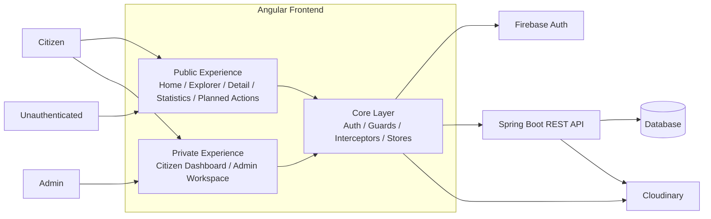
```mermaid
flowchart LR
    Citizen[Citizen]
    Admin[Admin]
    Unauth[Unauthenticated]

    subgraph Frontend[Angular Frontend]
        Public[Public Experience\nHome / Explorer / Detail / Statistics / Planned Actions]
        Private[Private Experience\nCitizen Dashboard / Admin Workspace]
        Core[Core Layer\nAuth / Guards / Interceptors / Stores]
    end

    Firebase[Firebase Auth]
    API[Spring Boot REST API]
    Cloudinary[Cloudinary]
    DB[(Database)]

    Citizen --> Public
    Citizen --> Private
    Admin --> Private
    Unauth --> Public

    Public --> Core
    Private --> Core
    Core --> Firebase
    Core --> API
    Core --> Cloudinary
    API --> DB
    API --> Cloudinary
```

#### 2. Route and Access Flow

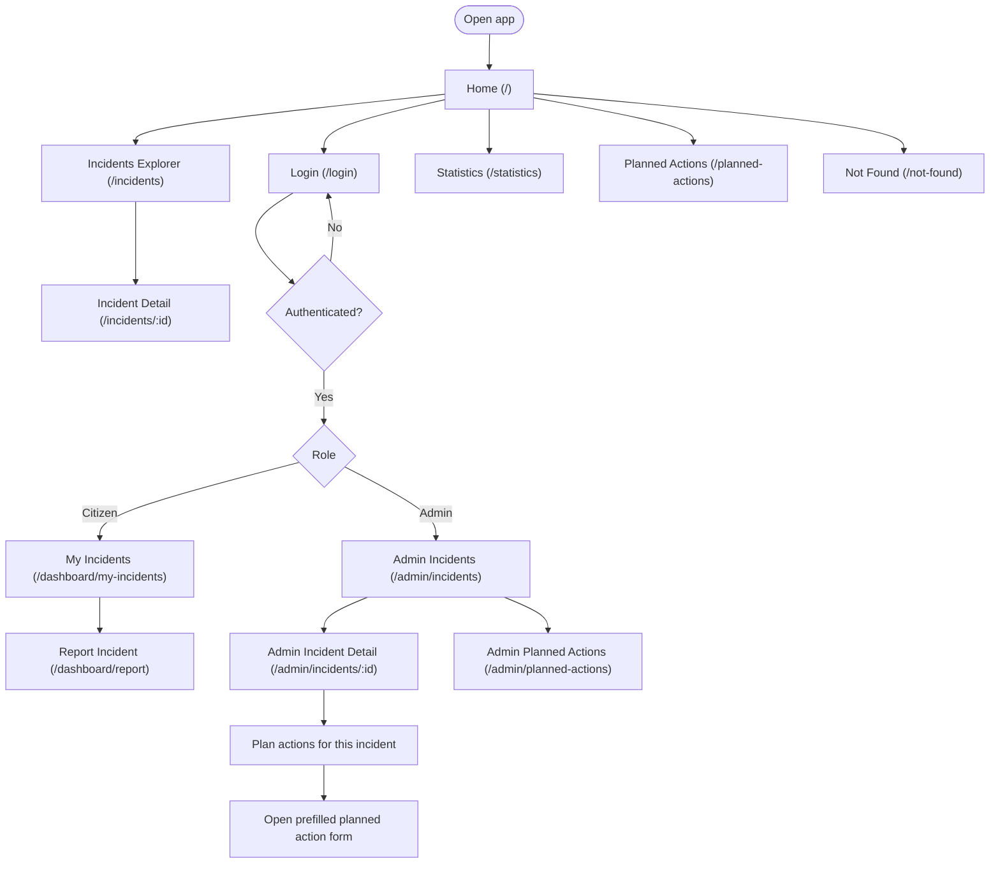
```mermaid
flowchart TD
    Start([Open app]) --> Landing["Home (/)"]
    Landing --> Login["Login (/login)"]
    Landing --> Explorer["Incidents Explorer (/incidents)"]
    Landing --> Statistics["Statistics (/statistics)"]
    Landing --> PublicCalendar["Planned Actions (/planned-actions)"]

    Explorer --> PublicDetail["Incident Detail (/incidents/:id)"]

    Login --> AuthCheck{Authenticated?}
    AuthCheck -->|No| Login
    AuthCheck -->|Yes| RoleCheck{Role}

    RoleCheck -->|Citizen| CitizenArea["My Incidents (/dashboard/my-incidents)"]
    RoleCheck -->|Admin| AdminArea["Admin Incidents (/admin/incidents)"]

    CitizenArea --> Report["Report Incident (/dashboard/report)"]

    AdminArea --> AdminDetail["Admin Incident Detail (/admin/incidents/:id)"]
    AdminArea --> AdminCalendar["Admin Planned Actions (/admin/planned-actions)"]
    AdminDetail --> PlanAction["Plan actions for this incident"]
    PlanAction --> PrefilledForm["Open prefilled planned action form"]

    Landing --> NotFound["Not Found (/not-found)"]
```

#### 3. Authentication and Role Routing

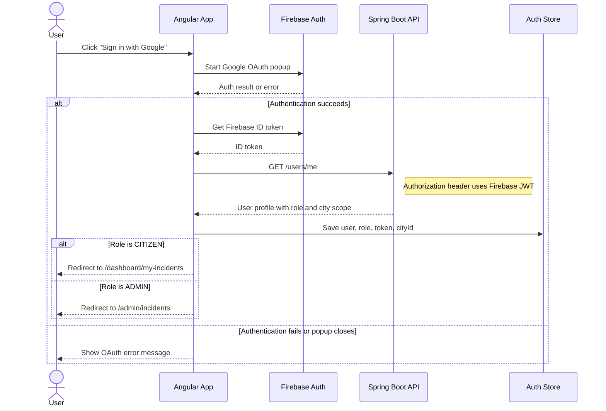
```mermaid
sequenceDiagram
    actor User
    participant UI as Angular App
    participant FB as Firebase Auth
    participant API as Spring Boot API
    participant Store as Auth Store

    User->>UI: Click "Sign in with Google"
    UI->>FB: Start Google OAuth popup
    FB-->>UI: Auth result or error

    alt Authentication succeeds
        UI->>FB: Get Firebase ID token
        FB-->>UI: ID token
        UI->>API: GET /users/me
        Note right of API: Authorization header uses Firebase JWT
        API-->>UI: User profile with role and city scope
        UI->>Store: Save user, role, token, cityId

        alt Role is CITIZEN
            UI-->>User: Redirect to /dashboard/my-incidents
        else Role is ADMIN
            UI-->>User: Redirect to /admin/incidents
        end
    else Authentication fails or popup closes
        UI-->>User: Show OAuth error message
    end
```

#### 4. Citizen Incident Reporting Flow

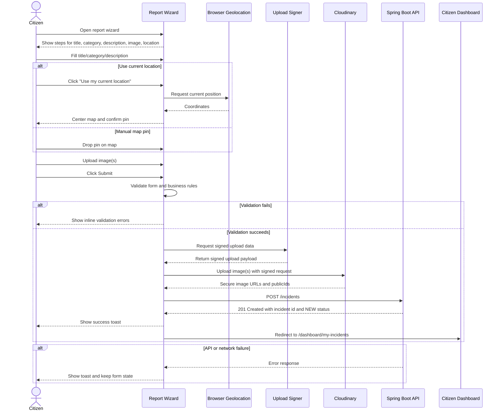
```mermaid
sequenceDiagram
    actor Citizen
    participant UI as Report Wizard
    participant Geo as Browser Geolocation
    participant Sign as Upload Signer
    participant Cloud as Cloudinary
    participant API as Spring Boot API
    participant Dashboard as Citizen Dashboard

    Citizen->>UI: Open report wizard
    UI-->>Citizen: Show steps for title, category, description, image, location
    Citizen->>UI: Fill title/category/description

    alt Use current location
        Citizen->>UI: Click "Use my current location"
        UI->>Geo: Request current position
        Geo-->>UI: Coordinates
        UI-->>Citizen: Center map and confirm pin
    else Manual map pin
        Citizen->>UI: Drop pin on map
    end

    Citizen->>UI: Upload image(s)
    Citizen->>UI: Click Submit
    UI->>UI: Validate form and business rules

    alt Validation fails
        UI-->>Citizen: Show inline validation errors
    else Validation succeeds
        UI->>Sign: Request signed upload data
        Sign-->>UI: Return signed upload payload
        UI->>Cloud: Upload image(s) with signed request
        Cloud-->>UI: Secure image URLs and publicIds
        UI->>API: POST /incidents
        API-->>UI: 201 Created with incident id and NEW status
        UI-->>Citizen: Show success toast
        UI->>Dashboard: Redirect to /dashboard/my-incidents
    end

    alt API or network failure
        API-->>UI: Error response
        UI-->>Citizen: Show toast and keep form state
    end
```

#### 5. Public Explorer and Detail Flow

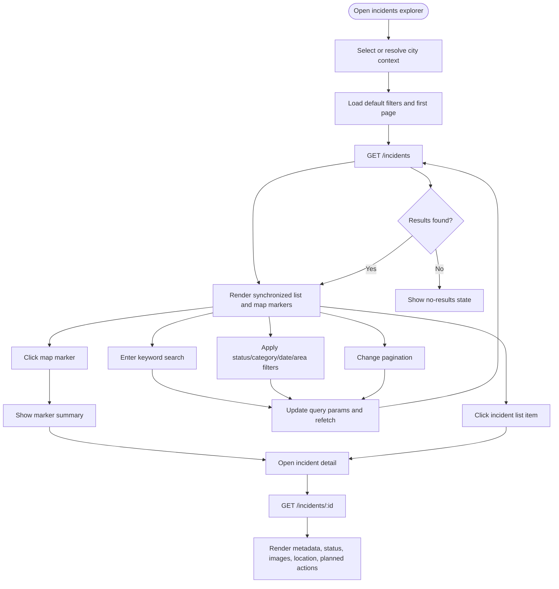
```mermaid
flowchart TD
    OpenExplorer([Open incidents explorer]) --> SelectCity[Select or resolve city context]
    SelectCity --> LoadDefault[Load default filters and first page]
    LoadDefault --> FetchIncidents[GET /incidents]
    FetchIncidents --> MapList[Render synchronized list and map markers]

    MapList --> Search[Enter keyword search]
    MapList --> Filter[Apply status/category/date/area filters]
    MapList --> Page[Change pagination]
    MapList --> Marker[Click map marker]
    MapList --> Row[Click incident list item]

    Search --> Requery[Update query params and refetch]
    Filter --> Requery
    Page --> Requery
    Requery --> FetchIncidents

    Marker --> Summary[Show marker summary]
    Summary --> Detail[Open incident detail]
    Row --> Detail
    Detail --> FetchDetail[GET /incidents/:id]
    FetchDetail --> ShowDetail[Render metadata, status, images, location, planned actions]

    FetchIncidents --> Empty{Results found?}
    Empty -->|No| EmptyState[Show no-results state]
    Empty -->|Yes| MapList
```

#### 6. Admin Incident Triage Flow

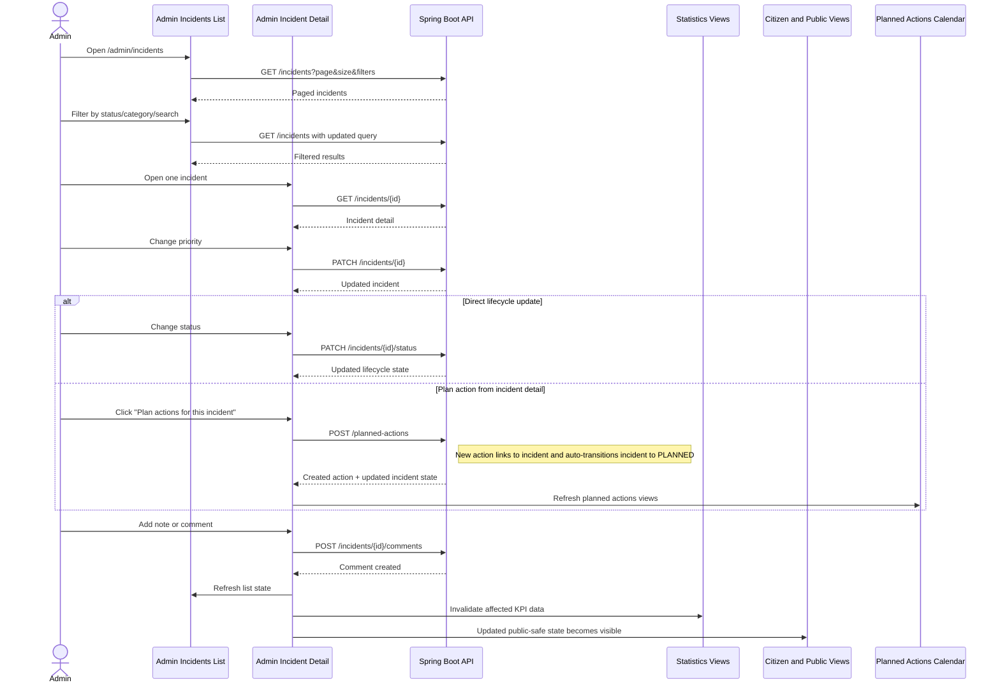
```mermaid
sequenceDiagram
    actor Admin
    participant List as Admin Incidents List
    participant Detail as Admin Incident Detail
    participant API as Spring Boot API
    participant Stats as Statistics Views
    participant PublicViews as Citizen and Public Views
    participant Calendar as Planned Actions Calendar

    Admin->>List: Open /admin/incidents
    List->>API: GET /incidents?page&size&filters
    API-->>List: Paged incidents
    Admin->>List: Filter by status/category/search
    List->>API: GET /incidents with updated query
    API-->>List: Filtered results

    Admin->>Detail: Open one incident
    Detail->>API: GET /incidents/{id}
    API-->>Detail: Incident detail
    Admin->>Detail: Change priority
    Detail->>API: PATCH /incidents/{id}
    API-->>Detail: Updated incident

    alt Direct lifecycle update
        Admin->>Detail: Change status
        Detail->>API: PATCH /incidents/{id}/status
        API-->>Detail: Updated lifecycle state
    else Plan action from incident detail
        Admin->>Detail: Click "Plan actions for this incident"
        Detail->>API: POST /planned-actions
        Note right of API: New action links to incident and auto-transitions incident to PLANNED
        API-->>Detail: Created action + updated incident state
        Detail->>Calendar: Refresh planned actions views
    end

    Admin->>Detail: Add note or comment
    Detail->>API: POST /incidents/{id}/comments
    API-->>Detail: Comment created

    Detail->>List: Refresh list state
    Detail->>Stats: Invalidate affected KPI data
    Detail->>PublicViews: Updated public-safe state becomes visible
```

#### 7. Planned Actions Flow

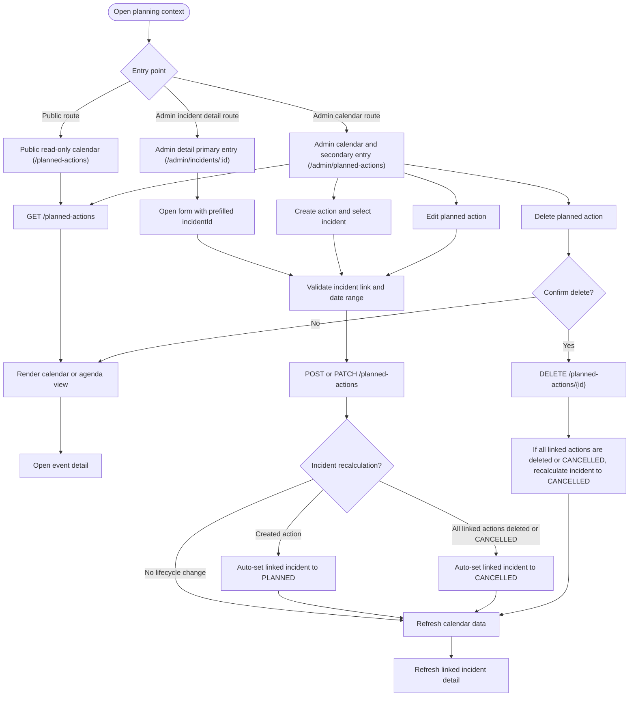
```mermaid
flowchart TD
    Start([Open planning context]) --> Entry{Entry point}

    Entry -->|Public route| PublicRead["Public read-only calendar (/planned-actions)"]
    Entry -->|Admin calendar route| AdminCalendar["Admin calendar and secondary entry (/admin/planned-actions)"]
    Entry -->|Admin incident detail route| DetailEntry["Admin detail primary entry (/admin/incidents/:id)"]

    PublicRead --> LoadEvents["GET /planned-actions"]
    AdminCalendar --> LoadEvents
    DetailEntry --> PrefillForm["Open form with prefilled incidentId"]
    LoadEvents --> CalendarView["Render calendar or agenda view"]
    CalendarView --> EventDetail["Open event detail"]

    AdminCalendar --> ManualCreate["Create action and select incident"]
    AdminCalendar --> Edit["Edit planned action"]
    AdminCalendar --> Delete["Delete planned action"]

    PrefillForm --> ValidateAction["Validate incident link and date range"]
    ManualCreate --> ValidateAction
    Edit --> ValidateAction
    ValidateAction --> SaveAction["POST or PATCH /planned-actions"]
    SaveAction --> SideEffect{Incident recalculation?}
    SideEffect -->|Created action| AutoPlan["Auto-set linked incident to PLANNED"]
    SideEffect -->|All linked actions deleted or CANCELLED| AutoCancel["Auto-set linked incident to CANCELLED"]
    SideEffect -->|No lifecycle change| ReloadCalendar["Refresh calendar data"]
    AutoPlan --> ReloadCalendar
    AutoCancel --> ReloadCalendar
    ReloadCalendar --> RefreshDetail["Refresh linked incident detail"]

    Delete --> ConfirmDelete{Confirm delete?}
    ConfirmDelete -->|Yes| DeleteCall["DELETE /planned-actions/{id}"]
    ConfirmDelete -->|No| CalendarView
    DeleteCall --> RecalcCancel["If all linked actions are deleted or CANCELLED, recalculate incident to CANCELLED"]
    RecalcCancel --> ReloadCalendar
```

#### 8. Incident Lifecycle State Machine

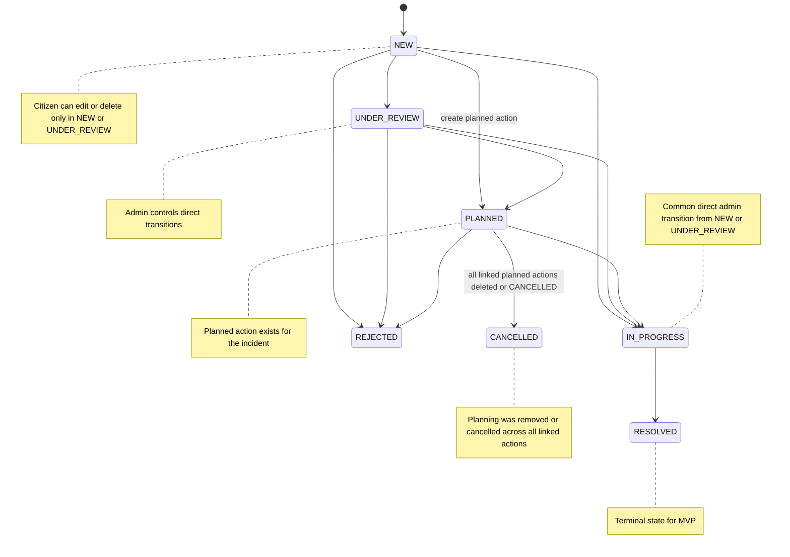
```mermaid
stateDiagram-v2
    [*] --> NEW
    NEW --> UNDER_REVIEW
    NEW --> IN_PROGRESS
    NEW --> PLANNED : create planned action
    UNDER_REVIEW --> PLANNED
    UNDER_REVIEW --> IN_PROGRESS
    PLANNED --> IN_PROGRESS
    PLANNED --> CANCELLED : all linked planned actions deleted or CANCELLED
    IN_PROGRESS --> RESOLVED

    NEW --> REJECTED
    UNDER_REVIEW --> REJECTED
    PLANNED --> REJECTED

    note right of NEW : Citizen can edit or delete only in NEW or UNDER_REVIEW
    note right of UNDER_REVIEW : Admin controls direct transitions
    note right of PLANNED : Planned action exists for the incident
    note right of CANCELLED : Planning was removed or cancelled across all linked actions
    note left of IN_PROGRESS : Common direct admin transition from NEW or UNDER_REVIEW
    note right of RESOLVED : Terminal state for MVP
```

#### 9. Frontend State and Data Flow

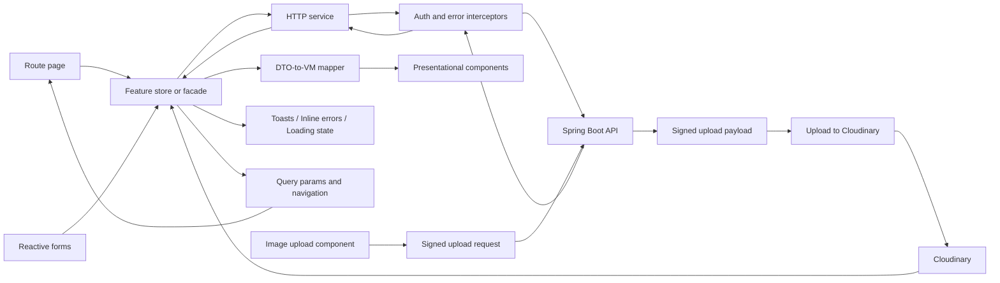
```mermaid
flowchart LR
    Page[Route page] --> Store[Feature store or facade]
    Store --> Mapper[DTO-to-VM mapper]
    Store --> Http[HTTP service]
    Http --> Interceptors[Auth and error interceptors]
    Interceptors --> API[Spring Boot API]
    API --> Interceptors
    Interceptors --> Http
    Http --> Store
    Mapper --> UI[Presentational components]

    Form[Reactive forms] --> Store
    Store --> Feedback[Toasts / Inline errors / Loading state]
    Store --> Router[Query params and navigation]
    Router --> Page

    Upload[Image upload component] --> Sign[Signed upload request]
    Sign --> API
    API --> SignResponse[Signed upload payload]
    SignResponse --> UploadToCloud[Upload to Cloudinary]
    UploadToCloud --> Cloudinary[Cloudinary]
    Cloudinary --> Store
```

#### 10. Domain Model Diagram

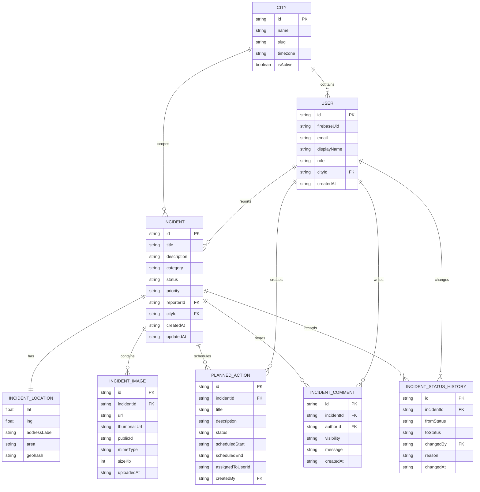
```mermaid
erDiagram
    CITY ||--o{ USER : contains
    CITY ||--o{ INCIDENT : scopes
    USER ||--o{ INCIDENT : reports
    INCIDENT ||--|| INCIDENT_LOCATION : has
    INCIDENT ||--o{ INCIDENT_IMAGE : contains
    INCIDENT ||--o{ PLANNED_ACTION : schedules
    INCIDENT ||--o{ INCIDENT_COMMENT : stores
    INCIDENT ||--o{ INCIDENT_STATUS_HISTORY : records
    USER ||--o{ INCIDENT_COMMENT : writes
    USER ||--o{ PLANNED_ACTION : creates
    USER ||--o{ INCIDENT_STATUS_HISTORY : changes

    CITY {
        string id PK
        string name
        string slug
        string timezone
        boolean isActive
    }

    USER {
        string id PK
        string firebaseUid
        string email
        string displayName
        string role
        string cityId FK
        string createdAt
    }

    INCIDENT {
        string id PK
        string title
        string description
        string category
        string status
        string priority
        string reporterId FK
        string cityId FK
        string createdAt
        string updatedAt
    }

    INCIDENT_LOCATION {
        float lat
        float lng
        string addressLabel
        string area
        string geohash
    }

    INCIDENT_IMAGE {
        string id PK
        string incidentId FK
        string url
        string thumbnailUrl
        string publicId
        string mimeType
        int sizeKb
        string uploadedAt
    }

    PLANNED_ACTION {
        string id PK
        string incidentId FK
        string title
        string description
        string status
        string scheduledStart
        string scheduledEnd
        string assignedToUserId
        string createdBy FK
    }

    INCIDENT_COMMENT {
        string id PK
        string incidentId FK
        string authorId FK
        string visibility
        string message
        string createdAt
    }

    INCIDENT_STATUS_HISTORY {
        string id PK
        string incidentId FK
        string fromStatus
        string toStatus
        string changedBy FK
        string reason
        string changedAt
    }
```

#### 11. Release and Quality Flow

```mermaid
flowchart TD
    Ready([Feature is ready]) --> Build[Implement page, store, services, and contracts]
    Build --> Unit[Run unit and component tests]
    Unit --> Integration[Integration tests]
    Integration --> E2E[Run E2E critical flows]
    E2E --> A11y[Run accessibility checks]
    A11y --> Perf[Run performance checks]
    Perf --> Review{All checks pass?}

    Review -->|No| Fix[Fix issues and rerun checks]
    Fix --> Unit
    Review -->|Yes| Done([Feature is done])
```
